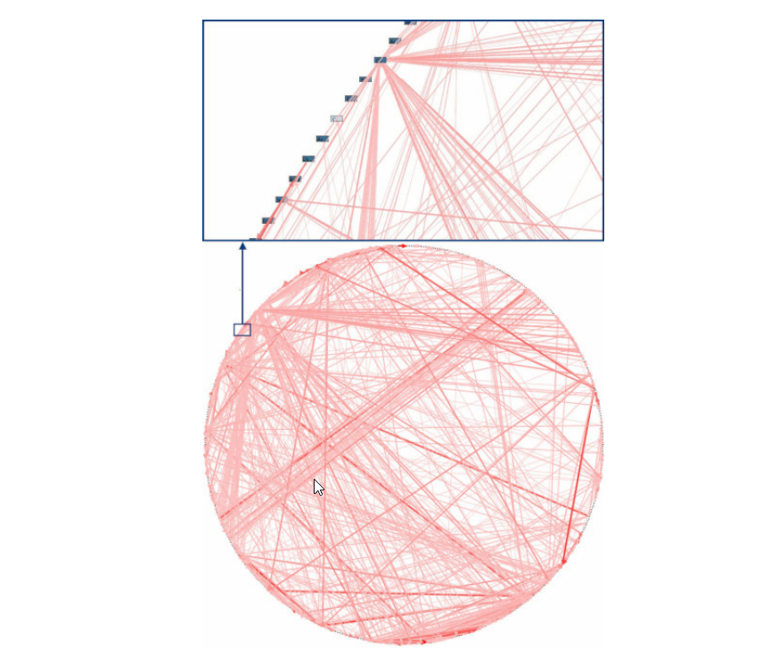

**Architecture Patterns with Python: Enabling Test-Driven Development, Domain-Driven Design, and Event-Driven Microservices**

Authors: Bob Gregory, Harry Percival

<!-- TOC -->
* [Introduction](#introduction)
* [Chapter1: Domain Modeling](#chapter1-domain-modeling)
<!-- TOC -->

# Introduction

Software systems, tend toward chaos. When we first start building a new system,
we have grand ideas that our code will be clean and well ordered, but over time we
find that it ends up a number of confusing classes and util modules. This is so common that software engineers have
their own term for chaos: the Big Ball of Mud anti-pattern.

If you’d like a picture of where we’re going, take a look at Figure below, but don’t worry if
none of it makes sense yet! We introduce each box in the figure, one by one.

# Chapter1: Domain Modeling
