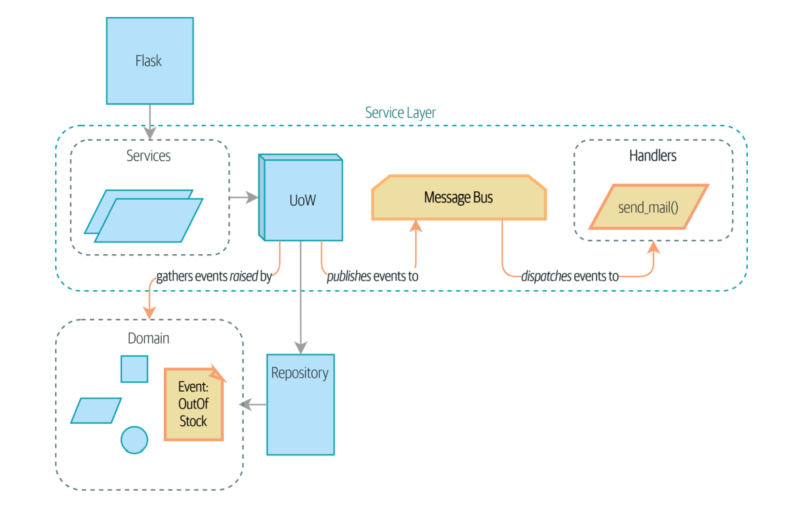
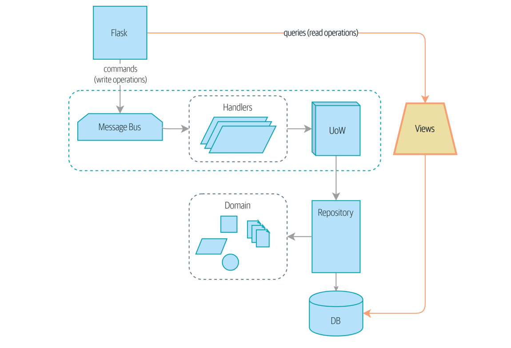

# Architecture Patterns with Python: Enabling Test-Driven Development, Domain-Driven Design, and Event-Driven Microservices

Authors: Bob Gregory, Harry Percival


<!-- TOC -->
* [Architecture Patterns with Python: Enabling Test-Driven Development, Domain-Driven Design, and Event-Driven Microservices](#architecture-patterns-with-python-enabling-test-driven-development-domain-driven-design-and-event-driven-microservices)
  * [Introduction](#introduction)
  * [Chapter1: Domain Modeling](#chapter1-domain-modeling)
  * [Chapter2: Repository Pattern](#chapter2-repository-pattern)
  * [Chapter3: A Brief Interlude: On Coupling and Abstractions](#chapter3-a-brief-interlude-on-coupling-and-abstractions)
  * [Chapter4: Our First Use Case: Flask API and Service Layer](#chapter4-our-first-use-case-flask-api-and-service-layer)
  * [Chapter5: TDD in High Gear and Low Gear](#chapter5-tdd-in-high-gear-and-low-gear)
  * [Chapter6: Unit of Work Pattern](#chapter6-unit-of-work-pattern)
  * [Chapter7: Aggregates and Consistency Boundaries](#chapter7-aggregates-and-consistency-boundaries)
* [Event-Driven Architecture](#event-driven-architecture)
  * [Chapter8: Events and the Message Bus](#chapter8-events-and-the-message-bus)
  * [Chapter9: Going to Town on the Message Bus](#chapter9-going-to-town-on-the-message-bus)
  * [Chapter10: Commands and Command Handler](#chapter10-commands-and-command-handler)
  * [Chapter11: Using Events to Integrate Microservices](#chapter11-using-events-to-integrate-microservices)
  * [Chapter12: Command-Query Responsibility Segregation (CQRS)](#chapter12-command-query-responsibility-segregation-cqrs)
  * [Chapter13: Dependency Injection (and Bootstrapping)](#chapter13-dependency-injection-and-bootstrapping)
<!-- TOC -->

[The source code in GitHub](https://github.com/cosmicpython/code)

## Introduction

Software systems, tend toward chaos. When we first start building a new system,
we have grand ideas that our code will be clean and well ordered, but over time we
find that it ends up a number of confusing classes and modules. This is so common that software engineers have
their own term for chaos: the Big Ball of Mud anti-pattern.


If you’d like a picture of where we’re going, take a look at Figure below, but don’t worry if
none of it makes sense yet! We introduce each box in the figure, one by one.


## Chapter1: Domain Modeling
This chapter looks into how we can model business processes with code, in a way
that’s highly compatible with TDD.

- **What Is a Domain Model?**

The **domain** is a fancy way of saying the problem you’re trying to solve. Depending on which system you’re
talking about, the domain might be purchasing and procurement, or product design,
or logistics and delivery. A **model** is a map of a process or phenomenon that captures a useful property. The domain model is the mental map that business owners have of their businesses.

In a nutshell, DDD says that the most important thing about software is that it provides a useful model of a problem. If we get that model right, our software delivers
value and makes new things possible.

- **Problem definition**

We’re going to use a real-world domain model throughout this book, specifically a
model from our current employment. MADE.com is a successful furniture retailer.
We source our furniture from manufacturers all over the world and sell it across
Europe. When you buy a sofa or a coffee table, we have to figure out how best to get your
goods from Poland or China or Vietnam and into your living room. At a high level, we have separate systems that are responsible for buying stock, selling
stock to customers, and shipping goods to customers. A system in the middle needs
to coordinate the process by allocating stock to a customer’s orders.


For the purposes of this book, we’re imagining that the business decides to implement
an exciting new way of allocating stock. Until now, the business has been presenting
stock and lead times based on what is physically available in the warehouse. If and
when the warehouse runs out, a product is listed as “out of stock” until the next shipment arrives from the manufacturer.

Here’s the innovation: if we have a system that can keep track of all our shipments
and when they’re due to arrive, we can treat the goods on those ships as real stock and
part of our inventory, just with slightly longer lead times. Fewer goods will appear to
be out of stock, we’ll sell more, and the business can save money by keeping lower
inventory in the domestic warehouse. We need a more complex allocation mechanism. **Time for
some domain modeling.**


- **Exploring the Domain Language**

The following notes we might have taken while having a conversation with our domain experts about allocation.

1- A product is identified by a SKU, pronounced “skew,” which is short for stock-keeping
unit. Customers place orders. An order is identified by an order reference and comprises multiple order lines, where each line has a SKU and a quantity. For example: _10 units of RED-CHAIR_

2- The purchasing department orders small batches of stock. A batch of stock has a
unique ID called a reference, a SKU, and a quantity.

3- We need to allocate order lines to batches. When we’ve allocated an order line to a
batch, we will send stock from that specific batch to the customer’s delivery address

4- We can’t allocate to a batch if the available quantity is less than the quantity of the
order line

5- We can’t allocate the same line twice.

- **Unit Testing Domain Models**

You’ll find some placeholder unit tests on [GitHub](https://github.com/cosmicpython/code/blob/chapter_01_domain_model_exercise/test_model.py), but you could just start from scratch, or combine/rewrite them however you like.

here is a sample unit test:

```angular2html
def test_allocating_to_a_batch_reduces_the_available_quantity():
     batch = Batch("batch-001", "SMALL-TABLE", qty=20, eta=date.today())
     line = OrderLine('order-ref', "SMALL-TABLE", 2)
     batch.allocate(line)
     assert batch.available_quantity == 18
```

The name of our unit test describes the behavior that we want to see from the system,
and the names of the classes and variables that we use are taken from the business
jargon. And here is a domain model that meets our requirements:

here is our UML and domain model:


todo: explain _purchased_quantity and allocations with more details

```angular2html

@dataclass(frozen=True)
class OrderLine:
    sku: str
    qty: int


class Batch:
    def __init__(self, ref: str, sku: str, qty: int, eta: Optional[date]):
        self.reference = ref
        self.sku = sku
        self.eta = eta
        self._purchased_quantity = qty
        self._allocations = set() 


    def allocate(self, line: OrderLine):
        if self.can_allocate(line):
            self._allocations.add(line)

    def deallocate(self, line: OrderLine):
        if line in self._allocations:
            self._allocations.remove(line)

    @property
    def allocated_quantity(self) -> int:
        return sum(line.qty for line in self._allocations)

    @property
    def available_quantity(self) -> int:
        return self._purchased_quantity - self.allocated_quantity

    def can_allocate(self, line: OrderLine) -> bool:
        return self.sku == line.sku and self.available_quantity >= line.qty

```
Now we’re getting somewhere! A batch now keeps track of a set of allocated Order
Line objects. When we allocate, if we have enough available quantity, we just add to
the set. Our available_quantity is now a calculated property: purchased quantity
minus allocated quantity.

- **Value Object**

Whenever we have a business concept that has data but no identity, we often choose
to represent it using the **Value Object** pattern. A value object is any domain object that
is uniquely identified by the data it holds. in previous example **OrderLine** is value object:

```angular2html

@dataclass(frozen=True)
class OrderLine:
    sku: str
    qty: int

```

todo: Why OrderLine is value object? How can we save its related data in DB?

- **Entities**

We use the term entity to describe a domain object that has long-lived identity. We can change their values, and they are
still recognizably the same thing. Batches, in our example, are entities.

- **Not Everything Has to Be an Object: A Domain Service Function**

A thing that allocates an order line, given a set of batches, sounds a lot like a function, and we can take advantage of the fact that Python is a multiparadigm language and just make it a function.
for example allocate service can act as the below:

```angular2html
def allocate(line: OrderLine, batches: List[Batch]) -> str:
    try:
        batch = next(b for b in sorted(batches) if b.can_allocate(line))
        batch.allocate(line)
        return batch.reference
    except StopIteration:
        raise OutOfStock(f"Out of stock for sku {line.sku}")
```

Python is a multiparadigm language, so let the “verbs” in your code be functions.

Figure below is a visual representation of where we’ve ended up.


That’ll probably do for now! We have a domain service that we can use for our first
use case. 

## Chapter2: Repository Pattern
It’s time to use the dependency inversion principle as a way of decoupling our core logic from infrastructural concerns. 
We’ll introduce the **Repository pattern**, a simplifying abstraction over data storage, allowing us to decouple our model layer from the business layer.
Figure below shows a little preview of what we’re going to build: a Repository object that sits between our domain model and the database.


The code for this chapter is in the [chapter_02_repository branch](https://github.com/cosmicpython/code/tree/chapter_02_repository)

When we build our first API endpoint, we know we’re going to have some code that looks more or less like the following.

```angular2html
@flask.route.gubbins
def allocate_endpoint():
     # extract order line from request
     line = OrderLine(request.params, ...)
     # load all batches from the DB
     batches = ...
     # call our domain service
     allocate(line, batches)
     # then save the allocation back to the database somehow
     return 201
```
At this point, though, our API endpoint might look something like the following, and we could get it to work just fine:
Using SQLAlchemy directly in our API endpoint

```angular2html
@flask.route.gubbins
def allocate_endpoint():
     session = start_session()
     # extract order line from request
     line = OrderLine(
     request.json['orderid'],
     request.json['sku'],
     request.json['qty'],
     )
     # load all batches from the DB
     batches = session.query(Batch).all()
     # call our domain service
     allocate(line, batches)
     # save the allocation back to the database
     session.commit()
     return 201
```

- **Introducing the Repository Pattern**

The **Repository Pattern** is a design pattern that acts as an abstraction layer between the data access layer and the business logic of an application. It encapsulates all data access logic and provides a clean API for the rest of the application to interact with, allowing for better separation of concerns and easier testing.
Here’s what an abstract base class (ABC) for our repository would look like:

```angular2html
class AbstractRepository(abc.ABC):
    @abc.abstractmethod
    def add(self, batch: model.Batch):
        raise NotImplementedError

    @abc.abstractmethod
    def get(self, reference) -> model.Batch:
        raise NotImplementedError
```
And here is a typical repository:

```angular2html

class SqlAlchemyRepository(AbstractRepository):
    def __init__(self, session):
        self.session = session

    def add(self, batch):
        self.session.add(batch)

    def get(self, reference):
        return self.session.query(model.Batch).filter_by(reference=reference).one()

    def list(self):
        return self.session.query(model.Batch).all()
```
And now our Flask endpoint might look something like the following:

```angular2html
@flask.route.gubbins
def allocate_endpoint():
     batches = SqlAlchemyRepository.list()
     lines = [
     OrderLine(l['orderid'], l['sku'], l['qty'])
     for l in request.params...
     ]
     allocate(lines, batches)
     session.commit()
     return 201
```

todo: What is the advantage of the mentioned approach? Explain its functionality

 - **What Is a Port and What Is an Adapter, in Python?** (Perplexity is used for better definition in this section)

In the context of the ports and adapters architectural pattern, a port is an abstract interface that defines how the application interacts with external components, while an adapter is a concrete implementation of that interface that handles the communication with the external component.

A **port** is an abstract interface, usually defined as an abstract base class (ABC) or a protocol, that specifies the methods and attributes that adapters must implement. For example:

```angular2html
from abc import ABC, abstractmethod

class PrintAdapterPort(ABC):
    @abstractmethod
    def print_number(self, number: int):
        raise NotImplementedError
```

In this example, **PrintAdapterPort** is a port that defines a **print_number** method for printing an integer. 

An **adapter** is a concrete class that implements a port's interface and handles the communication with an external component. For example:

```angular2html
class ConsolePrintAdapter(PrintAdapterPort):
    def print_number(self, number: int):
        print(f"The generated number is: {number}")
```

Here, **ConsolePrintAdapter** is an adapter that implements the **PrintAdapterPort** interface by printing the number to the console.

## Chapter3: A Brief Interlude: On Coupling and Abstractions

Allow us a brief digression on the subject of abstractions, dear reader.
The code for this chapter is in the [chapter_03_abstractions branch](https://github.com/cosmicpython/code/tree/chapter_03_abstractions)

A key theme in this book, hidden among the fancy patterns, is that we can use simple
abstractions to hide messy details. When we’re unable to change component A for fear of breaking component B, we say
that the components have become **coupled**. Globally, coupling is a nuisance: it increases the risk and the cost of changing our
code, sometimes to the point where we feel unable to make any changes at all.
We can reduce the degree of coupling within a system by **abstracting
away the details**.

Let’s see an example. Imagine we want to write code for synchronizing two file directories, which we’ll call the **_source_** and the **_destination_**:

1- If a file exists in the source but not in the destination, copy the file over.

2- If a file exists in the source, but it has a different name than in the destination, rename the destination file to match.

3- If a file exists in the destination but not in the source, remove it.

Our first and third requirements are simple enough: we can just compare two lists of paths. Our second is trickier, though. To detect renames, we’ll have to inspect the
content of files. For this, we can use a hashing function like MD5 or SHA-1. The code to generate a SHA-1 hash from a file is simple enough:

```angular2html
def hash_file(path):
    hasher = hashlib.sha1()
    with path.open("rb") as file:
        buf = file.read(BLOCKSIZE)
        while buf:
            hasher.update(buf)
            buf = file.read(BLOCKSIZE)
    return hasher.hexdigest()
```

todo: explain more this method

Our first hackish approach looks something like this:

```angular2html
import hashlib
import os
import shutil
from pathlib import Path

def sync(source, dest):
    # Walk the source folder and build a dict of filenames and their hashes
   source_hashes = {}
   for folder, _, files in os.walk(source):
     for fn in files:
       source_hashes[hash_file(Path(folder) / fn)] = fn

   seen = set() # Keep track of the files we've found in the target
   # Walk the target folder and get the filenames and hashes
   for folder, _, files in os.walk(dest):
     for fn in files:
       dest_path = Path(folder) / fn
       dest_hash = hash_file(dest_path)
       seen.add(dest_hash)
       # if there's a file in target that's not in source, delete it
       if dest_hash not in source_hashes:
         dest_path.remove()
       # if there's a file in target that has a different path in source,
       # move it to the correct path
       elif dest_hash in source_hashes and fn != source_hashes[dest_hash]:
         shutil.move(dest_path, Path(folder) / source_hashes[dest_hash])

   # for every file that appears in source but not target, copy the file to
   # the target
   for src_hash, fn in source_hashes.items():
     if src_hash not in seen:
       shutil.copy(Path(source) / fn, Path(dest) / fn)
```
todo: explain more this method


Fantastic! We have some code and it looks OK. The problem is that our domain
logic, “figure out the difference between two directories,” is tightly coupled to the I/O
code. We can’t run our difference algorithm without calling the pathlib, shutil, and
hashlib modules. On top of that, our code isn’t very extensible. Our high-level code is coupled to low-level details, and it’s making life hard.

- **What could we do to rewrite our code to make it more testable?**

We can think of these as three distinct responsibilities that the code has:

1. We interrogate the filesystem by using os.walk and determine hashes for a series
of paths. This is similar in both the source and the destination cases.
2. We decide whether a file is new, renamed, or redundant.
3. We copy, move, or delete files to match the source.


- **Implementing Our Chosen Abstractions**

Here is refactored version of my codes:

```angular2html
def sync(source, dest):
    # imperative shell step 1, gather inputs
    source_hashes = read_paths_and_hashes(source)
    dest_hashes = read_paths_and_hashes(dest)

    # step 2: call functional core
    actions = determine_actions(source_hashes, dest_hashes, source, dest)

    # imperative shell step 3, apply outputs
    for action, *paths in actions:
        if action == "COPY":
            shutil.copyfile(*paths)
        if action == "MOVE":
            shutil.move(*paths)
        if action == "DELETE":
            os.remove(paths[0])

def hash_file(path):
    hasher = hashlib.sha1()
    with path.open("rb") as file:
        buf = file.read(BLOCKSIZE)
        while buf:
            hasher.update(buf)
            buf = file.read(BLOCKSIZE)
    return hasher.hexdigest()


def read_paths_and_hashes(root):
    hashes = {}
    for folder, _, files in os.walk(root):
        for fn in files:
            hashes[hash_file(Path(folder) / fn)] = fn
    return hashes


def determine_actions(source_hashes, dest_hashes, source_folder, dest_folder):
    for sha, filename in source_hashes.items():
        if sha not in dest_hashes:
            sourcepath = Path(source_folder) / filename
            destpath = Path(dest_folder) / filename
            yield "COPY", sourcepath, destpath

        elif dest_hashes[sha] != filename:
            olddestpath = Path(dest_folder) / dest_hashes[sha]
            newdestpath = Path(dest_folder) / filename
            yield "MOVE", olddestpath, newdestpath

    for sha, filename in dest_hashes.items():
        if sha not in source_hashes:
            yield "DELETE", dest_folder / filename
```
The **determine_actions()** function will be the core of our business logic, which says,
“Given these two sets of hashes and filenames, what should we copy/move/delete?”. It
takes simple data structures and returns simple data structures:

todo: Explain this method with more details

## Chapter4: Our First Use Case: Flask API and Service Layer

In this chapter, we discuss the differences between orchestration logic, business logic,
and interfacing code, and we introduce the Service Layer pattern to take care of
orchestrating our workflows and defining the use cases of our system.

Figure below shows what we’re aiming for: we’re going to add a Flask API that will talk
to the service layer, which will serve as the entrypoint to our domain model. Because
our service layer depends on the **AbstractRepository**, we can unit test it by using
**FakeRepository** but run our production code using **SqlAlchemyRepository**.

todo: Where is FakeRepository come from?


The code for this chapter is in the [chapter_04_service_layer](https://github.com/cosmicpython/code/blob/chapter_04_service_layer/services.py)

- **A First End-to-End Test**

For now, we want to write one or maybe two tests that are going to exercise a “real”
API endpoint (using HTTP) and talk to a real database. Let’s call them end-to-end
tests because it’s one of the most self-explanatory names.

```angular2html
@pytest.mark.usefixtures("restart_api")
def test_happy_path_returns_201_and_allocated_batch(add_stock):
    sku, othersku = random_sku(), random_sku("other")
    earlybatch = random_batchref(1)
    laterbatch = random_batchref(2)
    otherbatch = random_batchref(3)
    add_stock(
        [
            (laterbatch, sku, 100, "2011-01-02"),
            (earlybatch, sku, 100, "2011-01-01"),
            (otherbatch, othersku, 100, None),
        ]
    )
    data = {"orderid": random_orderid(), "sku": sku, "qty": 3}
    url = config.get_api_url()

    r = requests.post(f"{url}/allocate", json=data)

    assert r.status_code == 201
    assert r.json()["batchref"] == earlybatch
```

**random_sku()**, **random_batchref()**, and so on are little helper functions that
generate randomized characters by using the uuid module. **add_stock** is a helper fixture that just hides away the details of manually inserting rows into the database using SQL.

- **The Straightforward Implementation**

Implementing things in the most obvious way, you might get something like this:

```angular2html
@app.route("/allocate", methods=['POST'])
def allocate_endpoint():
   session = get_session()
   batches = repository.SqlAlchemyRepository(session).list()
   line = model.OrderLine(
   request.json['orderid'],
   request.json['sku'],
   request.json['qty'],
   )
   batchref = model.allocate(line, batches)
   return jsonify({'batchref': batchref}), 201
```

But if we want to add more error handling to this API it should be changed as below:

```angular2html
def is_valid_sku(sku, batches):
    return sku in {b.sku for b in batches}

@app.route("/allocate", methods=['POST'])
def allocate_endpoint():
   session = get_session()
   batches = repository.SqlAlchemyRepository(session).list()
   line = model.OrderLine(
     request.json['orderid'],
     request.json['sku'],
     request.json['qty'],
   )
   if not is_valid_sku(line.sku, batches):
        return jsonify({'message': f'Invalid sku {line.sku}'}), 400
   try:
        batchref = model.allocate(line, batches)
   except model.OutOfStock as e:
        return jsonify({'message': str(e)}), 400
   session.commit()
   return jsonify({'batchref': batchref}), 201

```
But our Flask app is starting to look a bit unwieldy.

- **Introducing a Service Layer, and Using FakeRepository to Unit Test It**

If we look at what our Flask app is doing, there’s quite a lot of what we might call
orchestration—fetching stuff out of our repository, validating our input against data‐
base state, handling errors, and committing in the happy path. In the following we add service layer in TDD manner.

Our fake repository, an in-memory collection of batches is as below:

```angular2html
class FakeRepository(repository.AbstractRepository):
    def __init__(self, batches):
        self._batches = set(batches)

    def add(self, batch):
        self._batches.add(batch)

    def get(self, reference):
        return next(b for b in self._batches if b.reference == reference)

    def list(self):
        return list(self._batches)
```
FakeRepository holds the Batch objects that will be used by our test. Unit testing with fakes at the service layer:

```angular2html
def test_returns_allocation():
    line = model.OrderLine("o1", "COMPLICATED-LAMP", 10)
    batch = model.Batch("b1", "COMPLICATED-LAMP", 100, eta=None)
    repo = FakeRepository([batch])

    result = services.allocate(line, repo, FakeSession())
    assert result == "b1"


def test_error_for_invalid_sku():
    line = model.OrderLine("o1", "NONEXISTENTSKU", 10)
    batch = model.Batch("b1", "AREALSKU", 100, eta=None)
    repo = FakeRepository([batch])

    with pytest.raises(services.InvalidSku, match="Invalid sku NONEXISTENTSKU"):
        services.allocate(line, repo, FakeSession())
```

And finally we’ll write a service function that looks something like this (services.py):

```angular2html
class InvalidSku(Exception):
    pass


def is_valid_sku(sku, batches):
    return sku in {b.sku for b in batches}


def allocate(line: OrderLine, repo: AbstractRepository, session) -> str:
    batches = repo.list()
    if not is_valid_sku(line.sku, batches):
        raise InvalidSku(f"Invalid sku {line.sku}")
    batchref = model.allocate(line, batches)
    session.commit()
    return batchref
```
Our services module (services.py) will define an **allocate()** service-layer function. It will sit between our API layer and
the **allocate()** domain service function from our domain model. Here We fetch some objects from the repository. We make some checks or assertions about the request against the current state of
the world. We call a domain service and If all is well, we save/update any state we’ve changed. That last step is a little unsatisfactory at the moment, as our service layer is tightly
coupled to our database layer. We’ll improve that in Chapter 6 with the **Unit of Work pattern**.

- **Depend on Abstractions**

Notice one more thing about our service-layer function:
It depends on a repository. We’ve chosen to make the dependency explicit, and we’ve
used the type hint to say that we depend on **AbstractRepository**. This means it’ll
work both when the tests give it a **FakeRepository** and when the Flask app gives it a
**SqlAlchemyRepository**. If you remember **“The Dependency Inversion Principle”** this is what we
mean when we say we should “**depend on abstractions**.” Our high-level module, the
**service layer**, depends on the **repository abstraction**.

our Flask app now looks a lot
cleaner:
```angular2html
@app.route("/allocate", methods=["POST"])
def allocate_endpoint():
    session = get_session()
    repo = repository.SqlAlchemyRepository(session)
    line = model.OrderLine(
        request.json["orderid"], request.json["sku"], request.json["qty"],
    )

    try:
        batchref = services.allocate(line, repo, session)
    except (model.OutOfStock, services.InvalidSku) as e:
        return {"message": str(e)}, 400

    return {"batchref": batchref}, 201
```

We instantiate a database session and some repository objects. We extract the user’s commands from the web request and pass them to a
domain service. We return some JSON responses with the appropriate status codes.

The responsibilities of the Flask app are just standard web stuff: per-request session
management, parsing information out of POST parameters, response status codes,
and JSON. All the orchestration logic is in the use case/service layer, and the domain
logic stays in the domain.

- **Putting Things in Folders to See Where It All Belongs**
As our application gets bigger, we’ll need to keep tidying our directory structure. The
layout of our project gives us useful hints about what kinds of object we’ll find in each
file. Here’s one way we could organize things:


1- Let’s have a folder for our domain model. Currently that’s just one file, but for a
more complex application, you might have one file per class; you might have
helper parent classes for **Entity**, **ValueObject**, and **Aggregate**, and you might
add an **exceptions.py** for domain-layer exceptions and, as you’ll see in Part II,
**commands.py** and **events.py**.

2- We’ll distinguish the service layer. Currently that’s just one file called **services.py**
for our service-layer functions. You could add service-layer exceptions here, and
as you’ll see in Chapter 5, we’ll add **unit_of_work.py**.

3- Adapters is a nod to the ports and adapters terminology. This will fill up with any
other abstractions around external I/O (e.g., a redis_client.py). Strictly speaking,
you would call these secondary adapters or driven adapters, or sometimes inwardfacing adapters.

4- Entrypoints are the places we drive our application from. In the official ports and
adapters terminology, these are adapters too, and are referred to as primary, driv‐
ing, or outward-facing adapters.

- **The DIP in Action**

Here are the dependencies tree in our app when we run tests and when we run the application.


todo: explain more details about these figures and DIP

But there are still some bits of awkwardness to tidy up:

1- The service layer is still tightly coupled to the domain, because its API is
expressed in terms of OrderLine objects. In Chapter 5, we’ll fix that and talk
about the way that the service layer enables more productive TDD.

2- The service layer is tightly coupled to a session object. In Chapter 6, we’ll introduce one more pattern that works closely with the Repository and Service Layer
patterns, the Unit of Work pattern, and everything will be absolutely lovely. You’ll
see!

## Chapter5: TDD in High Gear and Low Gear
[Source Code](https://github.com/cosmicpython/code/tree/chapter_05_high_gear_low_gear)

We’ve introduced the service layer to capture some of the additional orchestration
responsibilities we need from a working application. The service layer helps us clearly
define our use cases and the workflow for each: what we need to get from our repositories, what pre-checks and current state validation we should do, and what we save at
the end. But currently, many of our unit tests operate at a lower level, acting directly on the
model. In this chapter we’ll discuss the trade-offs involved in moving those tests up to
the service-layer level, and some more general testing guidelines.

- **Should Domain Layer Tests Move to the Service Layer?**

Since we can test our software against the service layer, we don’t really need tests for the domain model anymore.
Instead, we could rewrite all of the domain-level tests from Chapter 1 in terms of the service layer. here is an example:

domain-layer test:

```angular2html
def test_prefers_current_stock_batches_to_shipments():
   in_stock_batch = Batch("in-stock-batch", "RETRO-CLOCK", 100, eta=None)
   shipment_batch = Batch("shipment-batch", "RETRO-CLOCK", 100, eta=tomorrow)
   line = OrderLine("oref", "RETRO-CLOCK", 10)

   allocate(line, [in_stock_batch, shipment_batch])

   assert in_stock_batch.available_quantity == 90
   assert shipment_batch.available_quantity == 100

```
service-layer test:

```angular2html
def test_prefers_warehouse_batches_to_shipments():
   in_stock_batch = Batch("in-stock-batch", "RETRO-CLOCK", 100, eta=None)
   shipment_batch = Batch("shipment-batch", "RETRO-CLOCK", 100, eta=tomorrow)
   repo = FakeRepository([in_stock_batch, shipment_batch])
   session = FakeSession()
   line = OrderLine('oref', "RETRO-CLOCK", 10)

  services.allocate(line, repo, session)

  assert in_stock_batch.available_quantity == 90
  assert shipment_batch.available_quantity == 100

```

Tests are supposed to help us change our system fearlessly, but often we see teams
writing too many tests against their domain model. This causes problems when they
come to change their codebase and find that they need to update tens or even hundreds of unit tests.

As we get further into the book, you’ll see how the service layer forms an API for our
system that we can drive in multiple ways. Testing against this API reduces the
amount of code that we need to change when we refactor our domain model. If we
restrict ourselves to testing only against the service layer, we won’t have any tests that
directly interact with “private” methods or attributes on our model objects, which
leaves us freer to refactor them.

- **On Deciding What Kind of Tests to Write**

You might be asking yourself, “Should I rewrite all my unit tests, then? Is it wrong to
write tests against the domain model?” To answer those questions, it’s important to
understand the trade-off between coupling and design feedback (see Figure below).


We only get that feedback, though, when we’re working closely with the target code.
A test for the HTTP API tells us nothing about the fine-grained design of our objects,
because it sits at a much higher level of abstraction. On the other hand, we can rewrite our entire application and, so long as we don’t
change the URLs or request formats, our HTTP tests will continue to pass. This gives
us confidence that large-scale changes, like changing the database schema, haven’t
broken our code.


- **High and Low Gear**

When starting a new project or when hitting a particularly gnarly problem, we will
drop back down to writing tests against the domain model so we get better feedback
and executable documentation of our intent.

The metaphor we use is that of shifting gears. When starting a journey, the bicycle
needs to be in a low gear so that it can overcome inertia. Once we’re off and running,
we can go faster and more efficiently by changing into a high gear; but if we suddenly
encounter a steep hill or are forced to slow down by a hazard, we again drop down to
a low gear until we can pick up speed again.

- **Fully Decoupling the Service-Layer Tests from the Domain**

We still have direct dependencies on the domain in our service-layer tests, because we
use domain objects to set up our test data and to invoke our service-layer functions.
To have a service layer that’s fully decoupled from the domain, we need to rewrite its
API to work in terms of primitives.
Our service layer currently takes an OrderLine domain object:

```angular2html
def allocate(line: OrderLine, repo: AbstractRepository, session) -> str:
```
How would it look if its parameters were all primitive types?

```angular2html
def allocate(orderid: str, sku: str, qty: int, repo: AbstractRepository, session) -> str:
```

Tests now use primitives in function call

```angular2html
def test_returns_allocation():
   batch = model.Batch("batch1", "COMPLICATED-LAMP", 100, eta=None)
   repo = FakeRepository([batch])

   result = services.allocate("o1", "COMPLICATED-LAMP", 10, repo, FakeSession())
   assert result == "batch1"

```
But our tests still depend on the domain, because we still manually instantiate **Batch**
objects. So, if one day we decide to massively refactor how our Batch model works,
we’ll have to change a bunch of tests.

- **Adding a Missing Service**

We could go one step further, though. If we had a service to add stock, we could use
that and make our service-layer tests fully expressed in terms of the service layer’s
official use cases, removing all dependencies on the domain:

```angular2html
def add_batch(
        ref: str, sku: str, qty: int, eta: Optional[date],
        repo: AbstractRepository, session):
     repo.add(model.Batch(ref, sku, qty, eta))
     session.commit()
```
Should you write a new service just because it would help remove
dependencies from your tests? Probably not. But in this case, we
almost definitely would need an **add_batch** service one day
anyway.

That now allows us to rewrite all of our service-layer tests purely in terms of the services themselves, using only primitives, and without any dependencies on the model:

```angular2html

def test_allocate_returns_allocation():
    repo, session = FakeRepository([]), FakeSession()
    services.add_batch("batch1", "COMPLICATED-LAMP", 100, None, repo, session)
    result = services.allocate("o1", "COMPLICATED-LAMP", 10, repo, session)
    assert result == "batch1"

def test_allocate_errors_for_invalid_sku():
    repo, session = FakeRepository([]), FakeSession()
    services.add_batch("b1", "AREALSKU", 100, None, repo, session)

    with pytest.raises(services.InvalidSku, match="Invalid sku NONEXISTENTSKU"):
        services.allocate("o1", "NONEXISTENTSKU", 10, repo, FakeSession())

```

This is a really nice place to be in. Our service-layer tests depend on only the service
layer itself, leaving us completely free to refactor the model as we see fit.

- **Carrying the Improvement Through to the E2E Tests**

In the same way that adding **add_batch** helped decouple our service-layer tests from
the model, adding an API endpoint to add a batch would remove the need for the
ugly add_stock fixture, and our E2E tests could be free of those hardcoded SQL queries and the direct dependency on the database

API for adding a batch:

```angular2html
@app.route("/add_batch", methods=["POST"])
def add_batch():
    session = get_session()
    repo = repository.SqlAlchemyRepository(session)
    eta = request.json["eta"]
    if eta is not None:
        eta = datetime.fromisoformat(eta).date()
    services.add_batch(
        request.json["ref"],
        request.json["sku"],
        request.json["qty"],
        eta,
        repo,
        session,
    )
    return "OK", 201
```

Now the API test would be as below:

```angular2html
def post_to_add_batch(ref, sku, qty, eta):
    url = config.get_api_url()
    r = requests.post(
        f"{url}/add_batch", json={"ref": ref, "sku": sku, "qty": qty, "eta": eta}
    )
    assert r.status_code == 201


@pytest.mark.usefixtures("postgres_db")
@pytest.mark.usefixtures("restart_api")
def test_happy_path_returns_201_and_allocated_batch():
    sku, othersku = random_sku(), random_sku("other")
    earlybatch = random_batchref(1)
    laterbatch = random_batchref(2)
    otherbatch = random_batchref(3)
    post_to_add_batch(laterbatch, sku, 100, "2011-01-02")
    post_to_add_batch(earlybatch, sku, 100, "2011-01-01")
    post_to_add_batch(otherbatch, othersku, 100, None)
    data = {"orderid": random_orderid(), "sku": sku, "qty": 3}

    url = config.get_api_url()
    r = requests.post(f"{url}/allocate", json=data)

    assert r.status_code == 201
    assert r.json()["batchref"] == earlybatch

```

- **Recap:**

1- Aim for one end-to-end test per feature

2- Write the bulk of your tests against the service layer

3- Maintain a small core of tests written against your domain mode

4- Error handling counts as a feature

5- Express your service layer in terms of primitives rather than domain objects.


## Chapter6: Unit of Work Pattern
[Source Code](https://github.com/cosmicpython/code/tree/chapter_06_uow)

In this chapter we’ll introduce the final piece of the puzzle that ties together the
Repository and Service Layer patterns: the **Unit of Work pattern**.

If the **Repository pattern** is our abstraction over the idea of persistent storage, the
**Unit of Work (UoW)** pattern is our abstraction over the idea of atomic operations. It
will allow us to finally and fully decouple our service layer from the data layer.

Figure below shows that, currently, a lot of communication occurs across the layers of
our infrastructure: the API talks directly to the database layer to start a session, it
talks to the repository layer to initialize SQLAlchemyRepository, and it talks to the
service layer to ask it to allocate. **Without UoW: API talks directly to three layers**


Figure below shows our target state. The Flask API now does only two things: it initializes a unit of work, and it invokes a service. The service collaborates with the UoW, but neither the service
function itself nor Flask now needs to talk directly to the database. And we’ll do it all using a lovely piece of Python syntax, a context manager.


- **The Unit of Work Collaborates with the Repository**

Here’s how the service layer will look when we’re finished:

```angular2html
def allocate(
    orderid: str, sku: str, qty: int,
    uow: unit_of_work.AbstractUnitOfWork) -> str:
    line = OrderLine(orderid, sku, qty)
    with uow:
        batches = uow.batches.list()
        if not is_valid_sku(line.sku, batches):
            raise InvalidSku(f"Invalid sku {line.sku}")
        batchref = model.allocate(line, batches)
        uow.commit()
    return batchref

```
We’ll start a UoW as a context manager. **uow.batches** is the batches repo, so the UoW provides us access to our permanent storage.
When we’re done, we commit or roll back our work, using the **UoW**.

- **Test-Driving a UoW with Integration Tests**

Here are our integration tests for the UOW:

```angular2html
def test_uow_can_retrieve_a_batch_and_allocate_to_it(session_factory):
    session = session_factory()
    insert_batch(session, "batch1", "HIPSTER-WORKBENCH", 100, None)
    session.commit()

    uow = unit_of_work.SqlAlchemyUnitOfWork(session_factory)
    with uow:
        batch = uow.batches.get(reference="batch1")
        line = model.OrderLine("o1", "HIPSTER-WORKBENCH", 10)
        batch.allocate(line)
        uow.commit()

    batchref = get_allocated_batch_ref(session, "o1", "HIPSTER-WORKBENCH")
    assert batchref == "batch1"
```
We initialize the UoW by using our custom session factory and get back a uow
object to use in our with block. The UoW gives us access to the batches repository via **uow.batches**. We call **commit()** on it when we’re done.

- **Unit of Work and Its Context Manager**

Abstract UoW context manager:

```angular2html
class AbstractUnitOfWork(abc.ABC):
    batches: repository.AbstractRepository

    def __enter__(self) -> AbstractUnitOfWork:
        return self

    def __exit__(self, *args):
        self.rollback()

    @abc.abstractmethod
    def commit(self):
        raise NotImplementedError

    @abc.abstractmethod
    def rollback(self):
        raise NotImplementedError
```
The UoW provides an attribute called **batches**, which will give us access to the
batches repository. If you’ve never seen a context manager, __enter__ and __exit__ are the two
magic methods that execute when we enter the with block and when we exit it,
respectively. They’re our setup and teardown phases. We’ll call this method to explicitly commit our work when we’re ready.
If we don’t commit, or if we exit the context manager by raising an error, we do a **rollback**.

Here is SQLAlchemy UoW:
```angular2html
class SqlAlchemyUnitOfWork(AbstractUnitOfWork):
    def __init__(self, session_factory=DEFAULT_SESSION_FACTORY):
        self.session_factory = session_factory

    def __enter__(self):
        self.session = self.session_factory()  # type: Session
        self.batches = repository.SqlAlchemyRepository(self.session)
        return super().__enter__()

    def __exit__(self, *args):
        super().__exit__(*args)
        self.session.close()

    def commit(self):
        self.session.commit()

    def rollback(self):
        self.session.rollback()
```
The module defines a default session factory that will connect to Postgres, but we
allow that to be overridden in our integration tests so that we can use SQLite
instead. The __enter__ method is responsible for starting a database session and instantiating a real repository that can use that session.
We close the session on exit. Finally, we provide concrete **commit()** and **rollback()** methods that use our
database session.

- **Fake Unit of Work for Testing**

Here’s how we use a fake UoW in our service-layer tests:

```angular2html
class FakeRepository(repository.AbstractRepository):
    def __init__(self, batches):
        self._batches = set(batches)

    def add(self, batch):
        self._batches.add(batch)

    def get(self, reference):
        return next(b for b in self._batches if b.reference == reference)

    def list(self):
        return list(self._batches)

class FakeUnitOfWork(unit_of_work.AbstractUnitOfWork):
    def __init__(self):
        self.batches = FakeRepository([])
        self.committed = False

    def commit(self):
        self.committed = True

    def rollback(self):
        pass
```

**FakeUnitOfWork** and **FakeRepository** are tightly coupled, just like the real UnittofWork and Repository classes. That’s fine because we recognize that the objects
are collaborators.

Here is some tests in service layer:

```angular2html
def test_add_batch():
    uow = FakeUnitOfWork()
    services.add_batch("b1", "CRUNCHY-ARMCHAIR", 100, None, uow)
    assert uow.batches.get("b1") is not None
    assert uow.committed


def test_allocate_returns_allocation():
    uow = FakeUnitOfWork()
    services.add_batch("batch1", "COMPLICATED-LAMP", 100, None, uow)
    result = services.allocate("o1", "COMPLICATED-LAMP", 10, uow)
    assert result == "batch1"
```

In our tests, we can instantiate a UoW and pass it to our service layer, rather than
passing a repository and a session. This is considerably less cumbersome.

- **Using the UoW in the Service Layer**

Here’s what our new service layer looks like:

```angular2html
def is_valid_sku(sku, batches):
    return sku in {b.sku for b in batches}


def add_batch(
    ref: str, sku: str, qty: int, eta: Optional[date],
    uow: unit_of_work.AbstractUnitOfWork,
):
    with uow:
        uow.batches.add(model.Batch(ref, sku, qty, eta))
        uow.commit()


def allocate(
    orderid: str, sku: str, qty: int,
    uow: unit_of_work.AbstractUnitOfWork,
) -> str:
    line = OrderLine(orderid, sku, qty)
    with uow:
        batches = uow.batches.list()
        if not is_valid_sku(line.sku, batches):
            raise InvalidSku(f"Invalid sku {line.sku}")
        batchref = model.allocate(line, batches)
        uow.commit()
    return batchref
```

Our service layer now has only the one dependency, once again on an **abstract UoW**.

- **Examples: Using UoW to Group Multiple Operations into an Atomic Unit**

Here are a few examples showing the Unit of Work pattern in use. You can see how it
leads to simple reasoning about what blocks of code happen together.

- **Example 1: Reallocate**

Suppose we want to be able to deallocate and then reallocate orders:

```angular2html
def reallocate(line: OrderLine, uow: AbstractUnitOfWork) -> str:
   with uow:
     batch = uow.batches.get(sku=line.sku)
     if batch is None:
       raise InvalidSku(f'Invalid sku {line.sku}')
     batch.deallocate(line)
     allocate(line)
     uow.commit()
```
If **deallocate()** fails, we don’t want to call **allocate()**, obviously. And, If **allocate()** fails, we probably don’t want to actually commit the **deallocate()** either.

- **Example 2: Change Batch Quantity**

Our shipping company gives us a call to say that one of the container doors opened,
and half our sofas have fallen into the Indian Ocean. Oops!

```angular2html
def change_batch_quantity(batchref: str, new_qty: int, uow: AbstractUnitOfWork):
   with uow:
     batch = uow.batches.get(reference=batchref)
     batch.change_purchased_quantity(new_qty)
     while batch.available_quantity < 0:
       line = batch.deallocate_one()
     uow.commit()
```
Here we may need to deallocate any number of lines. If we get a failure at any
stage, we probably want to commit none of the changes.

## Chapter7: Aggregates and Consistency Boundaries
[Source Code](https://github.com/cosmicpython/code/tree/chapter_07_aggregate)

In this chapter, we’d like to revisit our domain model to talk about invariants and
constraints, and see how our domain objects can maintain their own internal consistency, both conceptually and in persistent storage.

Figure below shows a preview of where we’re headed: we’ll introduce a new model object
called **Product** to wrap multiple batches, and we’ll make the old **allocate()** domain
service available as a method on **Product** instead.


- **Invariants, Constraints, and Consistency**

constraint is a rule that restricts the possible states our model can get into, while an **invariant** is defined a little more
precisely as a condition that is always true. If we were writing a hotel-booking system, we might have the constraint that double
bookings are not allowed. This supports the invariant that a room cannot have more
than one booking for the same night. Let’s look at a couple of concrete examples from our business requirements; we’ll start
with this one: **An order line can be allocated to only one batch at a time.**

In a single-threaded, single-user application, it’s relatively easy for us to maintain this
invariant. We can just allocate stock one line at a time, and raise an error if there’s no
stock available. This gets much harder when we introduce the idea of concurrency. Suddenly we
might be allocating stock for multiple order lines simultaneously. We usually solve this problem by applying **locks** to our database tables. This prevents
two operations from happening simultaneously on the same row or same table.

As we start to think about scaling up our app, we realize that our model of allocating
lines against all available batches may not scale. If we process tens of thousands of
orders per hour, and hundreds of thousands of order lines, we can’t hold a lock over
the whole **batches** table for every single one we’ll get deadlocks or performance
problems at the very least.

- **What Is an Aggregate?**

The **Aggregate** pattern is a design pattern from the DDD community that helps us to
resolve this tension. An **aggregate** is just a domain object that contains other domain
objects and lets us treat the whole collection as a single unit. it’s a good idea to nominate some entities to be the single entrypoint for modi‐
fying their related objects. It makes the system conceptually simpler and easy to
reason about if you nominate some objects to be in charge of consistency for the others.

For example, if we’re building a shopping site, the **Cart** might make a good aggregate:
it’s a collection of items that we can treat as a single unit. Importantly, we want to load
the entire basket as a single blob from our data store. We don’t want two requests to
modify the basket at the same time, or we run the risk of weird concurrency errors.
Instead, we want each change to the basket to run in a single database transaction. We don’t want to modify multiple baskets in a transaction, because there’s no use case
for changing the baskets of several customers at the same time. Each basket is a single
consistency boundary responsible for maintaining its own invariants.So, An **AGGREGATE** is a cluster of associated objects that we treat as a unit for the purpose of data changes.
our aggregate has a root entity (the Cart) that encapsulates access to items.
Each item has its own identity, but other parts of the system will always refer to the Cart only as an indivisible whole.

- **Choosing an Aggregate**

What aggregate should we use for our system? The choice is somewhat arbitrary, but
it’s important. The aggregate will be the boundary where we make sure every operation ends in a consistent state. This helps us to reason about our software and prevent
weird race issues.

The following example is constructed by **ChatGPT**.

- **Simple Example: Shopping Cart**

Consider a simple e-commerce system with a **ShoppingCart** aggregate. Here's how the aggregate ensures consistency:

- **Entities and Value Objects:**

1- **ShoppingCart (Aggregate Root):** Contains items, a total cost, and methods to add or remove items.

2- **CartItem (Entity within Aggregate):** Represents an individual item in the cart, including product details and quantity.

3- **ProductID (Value Object):** A unique identifier for a product.

- **Business Rule (Invariant)**

The total cost of the cart must always equal the sum of the costs of all items in the cart.

```angular2html
from pydantic import BaseModel
from typing import List, Dict

class ProductID(BaseModel):
    id: str

class CartItem(BaseModel):
    product_id: ProductID
    quantity: int
    price_per_unit: float
    
    def total_price(self):
        return self.quantity * self.price_per_unit

class ShoppingCart(BaseModel):
    items: Dict[str, CartItem]  # key is ProductID.id
    
    def add_item(self, product_id: ProductID, quantity: int, price_per_unit: float):
        if product_id.id in self.items:
            self.items[product_id.id].quantity += quantity
        else:
            self.items[product_id.id] = CartItem(product_id=product_id, quantity=quantity, price_per_unit=price_per_unit)
        self.check_invariants()
    
    def remove_item(self, product_id: ProductID, quantity: int):
        if product_id.id in self.items:
            if quantity >= self.items[product_id.id].quantity:
                del self.items[product_id.id]
            else:
                self.items[product_id.id].quantity -= quantity
        self.check_invariants()
    
    def total_cost(self):
        return sum(item.total_price() for item in self.items.values())
    
    def check_invariants(self):
        if self.total_cost() < 0:
            raise ValueError("Total cost cannot be negative.")

```

In this example:

1- The **ShoppingCart** class (aggregate root) manages all modifications to the cart's contents.

2- It ensures the invariant (total cost is correct) is maintained after any changes such as adding or removing items.

3- All interactions with **CartItem** objects go through the **ShoppingCart**, which controls and checks the consistency of its internal state.
This model allows the application to maintain consistent rules about how products are added or removed, ensuring data integrity and business rule enforcement within the shopping cart system.

(According to the previous rule) only Aggregate Root can be directly retrieved from the database by Query. In other words, a Repository is defined for each Aggregate Root, and other objects cannot be retrieved directly and must be retrieved by the corresponding Aggregate Root. Also, direct access to save or edit an entity inside an Aggregate is meaningless, and database transactions are meaningful at the level of an Aggregate.

- **Aggregates, Bounded Contexts, and Microservices**

One of the most important contributions from Evans and the DDD community is the concept of **bounded contexts**.
In essence, this was a reaction against attempts to capture entire businesses into a single model. The word customer means different things to people in sales, customer ser‐
vice, logistics, support, and so on. Attributes needed in one context are irrelevant in
another; more perniciously, concepts with the same name can have entirely different
meanings in different contexts. Rather than trying to build a single model (or class, or
database) to capture all the use cases, it’s better to have several models, draw boundaries around each context, and handle the translation between different contexts
explicitly. This concept translates very well to the world of microservices, where each microservice is free to have its own concept of “customer” and its own rules for translating that
to and from other microservices it integrates with. Whether or not you have a microservices architecture, a key consideration in choos‐
ing your aggregates is also choosing the bounded context that they will operate in. By
restricting the context, you can keep your number of aggregates low and their size
manageable.

- **One Aggregate = One Repository**

Once you define certain entities to be aggregates, we need to apply the rule that they
are the only entities that are publicly accessible to the outside world. In other words,
the only repositories we are allowed should be repositories that return aggregates.

In our case, we’ll switch from **BatchRepository** to **ProductRepository**:

```angular2html
class AbstractRepository(abc.ABC):
    @abc.abstractmethod
    def add(self, product: model.Product):
        raise NotImplementedError

    @abc.abstractmethod
    def get(self, sku) -> model.Product:
        raise NotImplementedError


class AbstractUnitOfWork(abc.ABC):
    products: repository.AbstractRepository

    def __enter__(self) -> AbstractUnitOfWork:
        return self

    def __exit__(self, *args):
        self.rollback()

    @abc.abstractmethod
    def commit(self):
        raise NotImplementedError

    @abc.abstractmethod
    def rollback(self):
        raise NotImplementedError
```

Service layer

```angular2html
def add_batch(
    ref: str, sku: str, qty: int, eta: Optional[date],
    uow: unit_of_work.AbstractUnitOfWork,
):
    with uow:
        product = uow.products.get(sku=sku)
        if product is None:
            product = model.Product(sku, batches=[])
            uow.products.add(product)
        product.batches.append(model.Batch(ref, sku, qty, eta))
        uow.commit()


def allocate(
    orderid: str, sku: str, qty: int,
    uow: unit_of_work.AbstractUnitOfWork,
) -> str:
    line = OrderLine(orderid, sku, qty)
    with uow:
        product = uow.products.get(sku=line.sku)
        if product is None:
            raise InvalidSku(f"Invalid sku {line.sku}")
        batchref = product.allocate(line)
        uow.commit()
    return batchref
```

- **What About Performance?**

We’ve mentioned a few times that we’re modeling with aggregates because we want to
have high-performance software, but here we are loading all the batches when we
only need one. You might expect that to be inefficient, but there are a few reasons
why we’re comfortable here.

First, we’re purposefully modeling our data so that we can make a single query to the
database to read, and a single update to persist our changes. This tends to perform
much better than systems that issue lots of ad hoc queries. In systems that don’t
model this way, we often find that transactions slowly get longer and more complex
as the software evolves.

Second, we expect to have only 20 or so batches of each product at a time. Once a batch
is used up, we can discount it from our calculations. This means that the amount of
data we’re fetching shouldn’t get out of control over time.

The Aggregate pattern is designed to help manage
some technical constraints around consistency and performance. There isn’t one correct aggregate, and we should feel comfortable changing our minds if we find our
boundaries are causing performance woes.

- **Optimistic Concurrency with Version Numbers**

will be added soon ...

- **Implementation Options for Version Numbers**

will be added soon ...

- **Testing for Our Data Integrity Rules**

will be added soon ...

- **Pessimistic Concurrency Control Example: SELECT FOR UPDATE**

will be added soon ...

- **Wrap-Up**

we explicitly model an object as being the main
entrypoint to some subset of our model, and as being in charge of enforcing the
invariants and business rules that apply across all of those objects. Choosing the right aggregate is key, and it’s a decision you may revisit over time.

1- Aggregates are your entrypoints into the domain model

2- Aggregates are in charge of a consistency boundary


- **Part I Recap**


We’ve decoupled the infrastructural parts of our system, like the database and API
handlers, so that we can plug them into the outside of our application. This helps us
to keep our codebase well organized and stops us from building a big ball of mud.

By applying the dependency inversion principle, and by using ports-and-adapters inspired patterns like Repository and Unit of Work, we’ve made it possible to do TDD
in both high gear and low gear and to maintain a healthy test pyramid. We can test
our system edge to edge, and the need for integration and end-to-end tests is kept to a
minimum.

Lastly, we’ve talked about the idea of consistency boundaries. We don’t want to lock
our entire system whenever we make a change, so we have to choose which parts are
consistent with one another.

For a small system, this is everything you need to go and play with the ideas of
domain-driven design. You now have the tools to build database-agnostic domain
models that represent the shared language of your business experts. Hurrah!

At the risk of laboring the point—we’ve been at pains to point out
that each pattern comes at a cost. Each layer of indirection has a
price in terms of complexity and duplication in our code and will
be confusing to programmers who’ve never seen these patterns
before. If your app is essentially a simple CRUD wrapper around a
database and isn’t likely to be anything more than that in the foreseeable future, you don’t need these patterns. Go ahead and use
Django, and save yourself a lot of bother.


# Event-Driven Architecture

In Part II, we’ll show how the techniques from Part I can be extended to distributed
systems. We’ll zoom out to look at how we can compose a system from many small
components that interact through asynchronous message passing. We’ll see how our Service Layer and Unit of Work patterns allow us to reconfigure
our app to run as an asynchronous message processor, and how event-driven systems
help us to decouple aggregates and applications from one another.

## Chapter8: Events and the Message Bus

[Source Code](https://github.com/cosmicpython/code/tree/chapter_08_events_and_message_bus)

Our example will be a typical notification requirement: when we can’t allocate an
order because we’re out of stock, we should alert the buying team. They’ll go and fix
the problem by buying more stock, and all will be well. For a first version, our product owner says we can just send the alert by email.

We’ll start by doing the simplest, most expeditious thing, and talk about why it’s
exactly this kind of decision that leads us to the Big Ball of Mud. Then we’ll show how to use the **Domain Events** pattern to separate side effects from
our use cases, and how to use a simple **Message Bus pattern** for triggering behavior
based on those events. We’ll show a few options for creating those events and how to
pass them to the message bus, and finally we’ll show how the Unit of Work pattern
can be modified to connect the two together elegantly, as previewed in Figure below.



- **First, Let’s Avoid Making a Mess of Our Web Controllers**

So. Email alerts when we run out of stock. When we have new requirements like ones
that really have nothing to do with the core domain, it’s all too easy to start dumping
these things into our web controllers.

```angular2html
@app.route("/allocate", methods=['POST'])
def allocate_endpoint():
   line = model.OrderLine(
   request.json['orderid'],
   request.json['sku'],
   request.json['qty'],
   )
   try:
     uow = unit_of_work.SqlAlchemyUnitOfWork()
     batchref = services.allocate(line, uow)
   except (model.OutOfStock, services.InvalidSku) as e:
     send_mail(
     'out of stock',
     'stock_admin@made.com',
     f'{line.orderid} - {line.sku}')
     return jsonify({'message': str(e)}), 400
   return jsonify({'batchref': batchref}), 201

```
But Sending email isn’t the job of our HTTP layer, and we’d like to be able to unit test
this new feature.

- **And Let’s Not Make a Mess of Our Model Either**

Assuming we don’t want to put this code into our web controllers, because we want
them to be as thin as possible, we may look at putting it right at the source, in the
model:

```angular2html
def allocate(self, line: OrderLine) -> str:
   try:
     batch = next(
     b for b in sorted(self.batches) if b.can_allocate(line)
     )
     #...
   except StopIteration:
     email.send_mail('stock@made.com', f'Out of stock for {line.sku}')
     raise OutOfStock(f'Out of stock for sku {line.sku}')
```

But that’s even worse! We don’t want our model to have any dependencies on infrastructure concerns like **email.send_mail**.
The domain model’s job is to know that we’re out of stock, but the responsibility of
sending an alert belongs elsewhere. We should be able to turn this feature on or off,
or to switch to SMS notifications instead, without needing to change the rules of our
domain model.

- **Or the Service Layer!**

The requirement “Try to allocate some stock, and send an email if it fails” is an example of workflow orchestration: it’s a set of steps that the system has to follow to
achieve a goal.
We’ve written a service layer to manage orchestration for us, but even here the feature
feels out of place:

```angular2html
def allocate(
   orderid: str, sku: str, qty: int,
   uow: unit_of_work.AbstractUnitOfWork) -> str:
   line = OrderLine(orderid, sku, qty)
   with uow:
     product = uow.products.get(sku=line.sku)
     if product is None:
       raise InvalidSku(f'Invalid sku {line.sku}')
     try:
       batchref = product.allocate(line)
       uow.commit()
       return batchref
     except model.OutOfStock:
       email.send_mail('stock@made.com', f'Out of stock for {line.sku}')
       raise
```

Catching an exception and reraising it? It could be worse, but it’s definitely making us unhappy. Why is it so hard to find a suitable home for this code?

- **Single Responsibility Principle**

Really, this is a violation of the **single responsibility principle (SRP)** Our use case is
allocation. Our endpoint, service function, and domain methods are all called
**allocate**, not **allocate_and_send_mail_if_out_of_stock**.

**Rule of thumb:** if you can’t describe what your function does
without using words like “**then**” or “**and**,” you might be violating
the SRP.

To solve the problem, we’re going to split the orchestration into separate steps so that
the different concerns don’t get tangled up
 The domain model’s job is to know that
we’re out of stock, but the responsibility of sending an alert belongs elsewhere. We
should be able to turn this feature on or off, or to switch to SMS notifications instead,
without needing to change the rules of our domain model.

We’d also like to keep the service layer free of implementation details. We want to
apply the dependency inversion principle to notifications so that our service layer
depends on an abstraction, in the same way as we avoid depending on the database by
using a unit of work.

- **All Aboard the Message Bus!**

The patterns we’re going to introduce here are **Domain Events** and the **Message Bus**.
We can implement them in a few ways, so we’ll show a couple before settling on the
one we like most.

- **Events Are Simple Dataclasses**

An **event** is a kind of **value object**. Events don’t have any behavior, because they’re pure
data structures. We always name events in the language of the domain, and we think
of them as part of our domain model. We could store them in model.py, but we may as well keep them in their own file.

```angular2html
from dataclasses import dataclass

class Event:
    pass

@dataclass
class OutOfStock(Event):
    sku: str
```

Once we have a number of events, we’ll find it useful to have a parent class that
can store common attributes. It’s also useful for type hints in our message bus, as
you’ll see shortly. **dataclasses** are great for domain events too.

- **The Model Raises Events**

When our domain model records a fact that happened, we say it raises an event. Here’s what it will look like from the outside; if we ask Product to allocate but it can’t,
it should raise an event:

Test our aggregate to raise events:

```angular2html
def test_records_out_of_stock_event_if_cannot_allocate():
    batch = Batch("batch1", "SMALL-FORK", 10, eta=today)
    product = Product(sku="SMALL-FORK", batches=[batch])
    product.allocate(OrderLine("order1", "SMALL-FORK", 10))

    allocation = product.allocate(OrderLine("order2", "SMALL-FORK", 1))
    assert product.events[-1] == events.OutOfStock(sku="SMALL-FORK")
    assert allocation is None
```

Our aggregate will expose a new attribute called **.events** that will contain a list of
facts about what has happened, in the form of **Event objects**.

Here’s what the model looks like on the inside:

```angular2html
class Product:
    def __init__(self, sku: str, batches: List[Batch], version_number: int = 0):
        self.sku = sku
        self.batches = batches
        self.version_number = version_number
        self.events = []  # type: List[events.Event]

    def allocate(self, line: OrderLine) -> str:
        try:
            batch = next(b for b in sorted(self.batches) if b.can_allocate(line))
            batch.allocate(line)
            self.version_number += 1
            return batch.reference
        except StopIteration:
            self.events.append(events.OutOfStock(line.sku))
            return None
```

Here’s our new .events attribute in use. Rather than invoking some email-sending code directly, we record those events
at the place they occur, using only the language of the domain. We’re also going to stop raising an exception for the out-of-stock case. The event
will do the job the exception was doing.

We’re actually addressing a code smell we had until now, which is
that we were using exceptions for control flow. In general, if you’re
implementing domain events, don’t raise exceptions to describe the
same domain concept. As you’ll see later when we handle events in
the Unit of Work pattern, it’s confusing to have to reason about
events and exceptions together.

- **The Message Bus Maps Events to Handlers**

A message bus basically says, “When I see this event, I should invoke the following
handler function.” In other words, it’s a simple publish-subscribe system. Handlers
are subscribed to receive events, which we publish to the bus. It sounds harder than it
is, and we usually implement it with a dict:

```angular2html
def handle(event: events.Event):
    for handler in HANDLERS[type(event)]:
        handler(event)


def send_out_of_stock_notification(event: events.OutOfStock):
    email.send_mail(
        "stock@made.com",
        f"Out of stock for {event.sku}",
    )


HANDLERS = {
    events.OutOfStock: [send_out_of_stock_notification],
}
```

- **Option 1: The Service Layer Takes Events from the Model and Puts Them on the Message Bus**

Our domain model raises events, and our message bus will call the right handlers
whenever an event happens. Now all we need is to connect the two. We need some‐
thing to catch events from the model and pass them to the message bus. The simplest way to do this is by adding some code into our service layer:

```angular2html
def allocate(
    orderid: str, sku: str, qty: int,
    uow: unit_of_work.AbstractUnitOfWork,
) -> str:
    line = OrderLine(orderid, sku, qty)
    with uow:
        product = uow.products.get(sku=line.sku)
        if product is None:
            raise InvalidSku(f"Invalid sku {line.sku}")
        try:
          batchref = product.allocate(line)
          uow.commit()
          return batchref
        finally:
            messagebus.handle(product.events)
```

We keep the try/finally from our ugly earlier implementation. But now, instead of depending directly on an email infrastructure, the service
layer is just in charge of passing events from the model up to the message bus.
That already avoids some of the ugliness that we had in our naive implementation,
and we have several systems that work like this one, in which the service layer explicitly collects events from aggregates and passes them to the message bus.


- **Option 2: The Service Layer Raises Its Own Events**

Another variant on this that we’ve used is to have the service layer in charge of creating and raising events directly, rather than having them raised by the domain model:
Service layer calls messagebus.handle directly

```angular2html
def allocate(
    orderid: str, sku: str, qty: int,
    uow: unit_of_work.AbstractUnitOfWork,
) -> str:
    line = OrderLine(orderid, sku, qty)
    with uow:
        product = uow.products.get(sku=line.sku)
        if product is None:
            raise InvalidSku(f"Invalid sku {line.sku}")
        batchref = product.allocate(line)
        uow.commit()
        if batchref is None:
            messagebus.handle(events.OutOfStock(line.sku))
        return batchref
```

Again, we have applications in production that implement the pattern in this way.
What works for you will depend on the particular trade-offs you face, but we’d like to
show you what we think is the most elegant solution, in which we put the unit of
work in charge of collecting and raising events.

- **Option 3: The UoW Publishes Events to the Message Bus**

The **UoW** already has a **try/finally**, and it knows about all the aggregates currently
in play because it provides access to the repository. So it’s a good place to spot events
and pass them to the message bus:

```angular2html
class AbstractUnitOfWork(abc.ABC):
    products: repository.AbstractRepository

    def __enter__(self) -> AbstractUnitOfWork:
        return self

    def __exit__(self, *args):
        self.rollback()

    def commit(self):
        self._commit()
        self.publish_events()

    def publish_events(self):
        for product in self.products.seen:
            while product.events:
                event = product.events.pop(0)
                messagebus.handle(event)
```

We’ll change our commit method to require a private **._commit()** method from subclasses. After committing, we run through all the objects that our repository has seen and
pass their events to the message bus. That relies on the repository keeping track of aggregates that have been loaded
using a new attribute, .seen, as you’ll see in the next listing.

After the UoW and repository collaborate in this way to automatically keep track of
live objects and process their events, the service layer can be totally free of event handling concerns:

- **Wrap-Up**

Domain events give us a way to handle workflows in our system. We often find, listening to our domain experts, that they express requirements in a causal or temporal
way—for example, “When we try to allocate stock but there’s none available, then we
should send an email to the buying team.” The magic words “When X, then Y” often tell us about an event that we can make
concrete in our system. Treating events as first-class things in our model helps us
make our code more testable and observable, and it helps isolate concerns.

- **Domain Events and the Message Bus Recap**

1- We also use events for communicating between aggregates so that we don’t need
to run long-running transactions that lock against multiple tables.

2- You can think of a message bus as a dict that maps from events to their consumers. It doesn’t “know” anything about the meaning of events; it’s just a piece of
dumb infrastructure for getting messages around the system.

3- we can
tidy up by making our unit of work responsible for raising events that were
raised by loaded objects. This is the most complex design.

## Chapter9: Going to Town on the Message Bus

[Source Code](https://github.com/cosmicpython/code/tree/chapter_09_all_messagebus)


We’ll move from the current state, where events are an optional side effect to the situation in Figure below, where everything goes via the message bus, and our
app has been transformed fundamentally into a message processor.


- **A New Requirement Leads Us to a New Architecture**

Perhaps someone made a mistake on the number in the
manifest, or perhaps some sofas fell off a truck. Following a conversation with the
business we model the situation as in Figure below.


An event we’ll call **BatchQuantityChanged** should lead us to change the quantity on
the batch, yes, but also to apply a business rule: if the new quantity drops to less than
the total already allocated, we need to deallocate those orders from that batch. Then
each one will require a new allocation, which we can capture as an event called **AllocationRequired**.

- **Imagining an Architecture Change: Everything Will Be an Event Handler**

1- **services.allocate()** could be the handler for an **AllocationRequired** event and could emit **Allocated** events as its output.

2- **services.add_batch()** could be the handler for a **BatchCreated** event.

Our new requirement will fit the same pattern:

3- An event called **BatchQuantityChanged** can invoke a handler called
**change_batch_quantity()**.

4- And the new **AllocationRequired** events that it may raise can be passed on to
**services.allocate()** too, so there is no conceptual difference between a brand new allocation coming from the API and a reallocation that’s internally triggered
by a de allocation.

**Let’s work toward it all gradually**

1- We refactor our service layer into event handlers. We can get used to the idea of
events being the way we describe inputs to the system. In particular, the existing
**services.allocate()** function will become the handler for an event called **AllocationRequired**.

2- We build an end-to-end test that puts **BatchQuantityChanged** events into the system and looks for Allocated events coming out.

3- Our implementation will conceptually be very simple: a new handler for **BatchQuantityChanged** events, whose implementation will emit **AllocationRequired**
events, which in turn will be handled by the exact same handler for allocations
that the API uses.


- **Refactoring Service Functions to Message Handlers**

We start by defining the two events that capture our current API inputs—**AllocationRequired** and **BatchCreated**:

```angular2html
@dataclass
class BatchCreated(Event):
    ref: str
    sku: str
    qty: int
    eta: Optional[date] = None


@dataclass
class AllocationRequired(Event):
    orderid: str
    sku: str
    qty: int
```
Then we rename **services.py** to **handlers.py**; we add the existing message handler for
**send_out_of_stock_notification**; and most importantly, we change all the handlers so that they have the same inputs, an **event** and a **UoW**

```angular2html
def add_batch(
    event: events.BatchCreated,
    uow: unit_of_work.AbstractUnitOfWork,
):
    with uow:
        product = uow.products.get(sku=event.sku)
        if product is None:
            product = model.Product(event.sku, batches=[])
            uow.products.add(product)
        product.batches.append(
            model.Batch(event.ref, event.sku, event.qty, event.eta)
        )
        uow.commit()


def allocate(
    event: events.AllocationRequired,
    uow: unit_of_work.AbstractUnitOfWork,
) -> str:
    line = OrderLine(event.orderid, event.sku, event.qty)
    with uow:
        product = uow.products.get(sku=line.sku)
        if product is None:
            raise InvalidSku(f"Invalid sku {line.sku}")
        batchref = product.allocate(line)
        uow.commit()
        return batchref

```

- **The Message Bus Now Collects Events from the UoW**

Our event handlers now need a UoW. In addition, as our message bus becomes more
central to our application, it makes sense to put it explicitly in charge of collecting
and processing new events. There was a bit of a circular dependency between the
UoW and message bus until now, so this will make it one-way:

```angular2html
def handle(
    event: events.Event,
    uow: unit_of_work.AbstractUnitOfWork,
):
    results = []
    queue = [event]
    while queue:
        event = queue.pop(0)
        for handler in HANDLERS[type(event)]:
            results.append(handler(event, uow=uow))
            queue.extend(uow.collect_new_events())
    return results


HANDLERS = {
    events.BatchCreated: [handlers.add_batch],
    events.BatchQuantityChanged: [handlers.change_batch_quantity],
    events.AllocationRequired: [handlers.allocate],
    events.OutOfStock: [handlers.send_out_of_stock_notification],
}  # type: Dict[Type[events.Event], List[Callable]]
```
The message bus now gets passed the UoW each time it starts up. When we begin handling our first event, we start a queue.
We pop events from the front of the queue and invoke their handlers (the
HANDLERS dict hasn’t changed; it still maps event types to handler functions).
The message bus passes the UoW down to each handler. After each handler finishes, we collect any new events that have been generated
and add them to the queue.

In **unit_of_work.py**, **publish_events()** becomes a less active method, **collect_new_events()**:

```angular2html
class AbstractUnitOfWork(abc.ABC):
    products: repository.AbstractRepository

    def __enter__(self) -> AbstractUnitOfWork:
        return self

    def __exit__(self, *args):
        self.rollback()

    def commit(self):
        self._commit()

    def collect_new_events(self):
        for product in self.products.seen:
            while product.events:
                yield product.events.pop(0)

    @abc.abstractmethod
    def _commit(self):
        raise NotImplementedError

    @abc.abstractmethod
    def rollback(self):
        raise NotImplementedError
```
The **unit_of_work** module now no longer depends on **messagebus**. We no longer **publish_events** automatically on commit. The message bus is
keeping track of the event queue instead. And the UoW no longer actively puts events on the message bus; it just makes
them available.

- **Modifying Our API to Work with Events**

```angular2html
@app.route("/allocate", methods=["POST"])
def allocate_endpoint():
    try:
        event = events.AllocationRequired(
            request.json["orderid"], request.json["sku"], request.json["qty"]
        )
        results = messagebus.handle(event, unit_of_work.SqlAlchemyUnitOfWork())
        batchref = results.pop(0)
    except InvalidSku as e:
        return {"message": str(e)}, 400

    return {"batchref": batchref}, 201
```

Instead of calling the service layer with a bunch of primitives extracted from the
request JSON We instantiate an event. Then we pass it to the message bus. And we should be back to a fully functional application, but one that’s now fully
event-driven:

1- What used to be service-layer functions are now event handlers.

2- We use events as our data structure for capturing inputs to the system, as well as
for handing off of internal work packages.

3- The entire app is now best described as a message processor, or an event processor if you prefer

- **Implementing Our New Requirement**

we’ll receive as our inputs some new **BatchQuantityChanged** events and pass them to a handler, which in
turn might emit some **AllocationRequired** events, and those in turn will go back to
our existing handler for **reallocation**.


- **Our New Event**

The event that tells us a batch quantity has changed is simple; it just needs a batch
reference and a new quantity:

```angular2html
@dataclass
class BatchQuantityChanged(Event):
    ref: str
    qty: int
```

Implementation of new handler

```angular2html
def change_batch_quantity(
    event: events.BatchQuantityChanged,
    uow: unit_of_work.AbstractUnitOfWork,
):
    with uow:
        product = uow.products.get_by_batchref(batchref=event.ref)
        product.change_batch_quantity(ref=event.ref, qty=event.qty)
        uow.commit()
```
We realize we’ll need a new query type on our repository:

```angular2html
class AbstractRepository(abc.ABC):
    def __init__(self):
        self.seen = set()  # type: Set[model.Product]

    def get_by_batchref(self, batchref) -> model.Product:
        product = self._get_by_batchref(batchref)
        if product:
            self.seen.add(product)
        return product
```

- **A New Method on the Domain Model**

We add the new method to the model, which does the quantity change and deallocation(s) inline and publishes a new event. We also modify the existing allocate func‐
tion to publish an event:

```angular2html
class Product:
    def __init__(self, sku: str, batches: List[Batch], version_number: int = 0):
        self.sku = sku
        self.batches = batches
        self.version_number = version_number
        self.events = []  # type: List[events.Event]

    def change_batch_quantity(self, ref: str, qty: int):
        batch = next(b for b in self.batches if b.reference == ref)
        batch._purchased_quantity = qty
        while batch.available_quantity < 0:
            line = batch.deallocate_one()
            self.events.append(
                events.AllocationRequired(line.orderid, line.sku, line.qty)
            )


class Batch:
    def __init__(self, ref: str, sku: str, qty: int, eta: Optional[date]):
        self.reference = ref
        self.sku = sku
        self.eta = eta
        self._purchased_quantity = qty
        self._allocations = set()  # type: Set[OrderLine]

    def deallocate_one(self) -> OrderLine:
        return self._allocations.pop()
```

- **What Have We Achieved?**

Events are simple dataclasses that define the data structures for inputs and internal
messages within our system. This is quite powerful from a DDD standpoint, since
events often translate really well into business language. Handlers are the way we react to events. They can call down to our model or call out
to external services. We can define multiple handlers for a single event if we want to.
Handlers can also raise other events. This allows us to be very granular about what a
handler does and really stick to the SRP.

- **Why Have We Achieved?**

Here we’ve added quite a complicated use case (change quantity, deallocate, start new
transaction, reallocate, publish external notification), but architecturally, there’s been
no cost in terms of complexity. We’ve added new events, new handlers, and a new
external adapter (for email), all of which are existing categories of things in our architecture that we understand and know how to reason about, and that are easy to
explain to newcomers. Our moving parts each have one job, they’re connected to
each other in well-defined ways, and there are no unexpected side effects.

## Chapter10: Commands and Command Handler

[Source Code](https://github.com/cosmicpython/code/tree/chapter_10_commands)

In the previous chapter, we talked about using events as a way of representing the
inputs to our system, and we turned our application into a message-processing
machine.

- **Commands and Events**

Like events, **commands** are a type of message—instructions sent by one part of a system to another. We usually represent commands with dumb data structures and can
handle them in much the same way as events. Commands are sent by one actor to another specific actor with the expectation that a
particular thing will happen as a result. We name commands with imperative mood verb phrases
like “allocate stock” or “delay shipment. They express our wish for the system to do something.  As
a result, when they fail, the sender needs to receive error information.

**Events** are broadcast by an actor to all interested listeners. When we publish BatchQuantityChanged, we don’t know who’s going to pick it up. We name events with
past-tense verb phrases like “order allocated to stock” or “shipment delayed.Events capture facts about things that happened in the past. Since we don’t know
who’s handling an event, senders should not care whether the receivers succeeded or failed.

What kinds of commands do we have in our system right now?

```angular2html
class Command:
    pass


@dataclass
class Allocate(Command):
    orderid: str
    sku: str
    qty: int


@dataclass
class CreateBatch(Command):
    ref: str
    sku: str
    qty: int
    eta: Optional[date] = None


@dataclass
class ChangeBatchQuantity(Command):
    ref: str
    qty: int
```

- **Differences in Exception Handling**

We want to treat events and commands similarly, but not exactly the
same. Let’s see how our message bus changes:

```angular2html
Message = Union[commands.Command, events.Event]


def handle(
    message: Message,
    uow: unit_of_work.AbstractUnitOfWork,
):
    results = []
    queue = [message]
    while queue:
        message = queue.pop(0)
        if isinstance(message, events.Event):
            handle_event(message, queue, uow)
        elif isinstance(message, commands.Command):
            cmd_result = handle_command(message, queue, uow)
            results.append(cmd_result)
        else:
            raise Exception(f"{message} was not an Event or Command")
    return results
```

It still has a main **handle()** entrypoint that takes a message, which may be a command or an event. We dispatch events and commands to two different helper functions, shown
next.

Here’s how we handle events:

```angular2html
def handle_event(
    event: events.Event,
    queue: List[Message],
    uow: unit_of_work.AbstractUnitOfWork,
):
    for handler in EVENT_HANDLERS[type(event)]:
        try:
            logger.debug("handling event %s with handler %s", event, handler)
            handler(event, uow=uow)
            queue.extend(uow.collect_new_events())
        except Exception:
            logger.exception("Exception handling event %s", event)
            continue
```
Events go to a dispatcher that can delegate to multiple handlers per event. It catches and logs errors but doesn’t let them interrupt message processing.

And here’s how we do commands:

```angular2html
def handle_command(
    command: commands.Command,
    queue: List[Message],
    uow: unit_of_work.AbstractUnitOfWork,
):
    logger.debug("handling command %s", command)
    try:
        handler = COMMAND_HANDLERS[type(command)]
        result = handler(command, uow=uow)
        queue.extend(uow.collect_new_events())
        return result
    except Exception:
        logger.exception("Exception handling command %s", command)
        raise
```

The command dispatcher expects just one handler per command. If any errors are raised, they fail fast and will bubble up.
We also change the single HANDLERS dict into different ones for commands and
events. Commands can have only one handler, according to our convention:

```angular2html
EVENT_HANDLERS = {
    events.OutOfStock: [handlers.send_out_of_stock_notification],
}  # type: Dict[Type[events.Event], List[Callable]]

COMMAND_HANDLERS = {
    commands.Allocate: handlers.allocate,
    commands.CreateBatch: handlers.add_batch,
    commands.ChangeBatchQuantity: handlers.change_batch_quantity,
}  # type: Dict[Type[commands.Command], Callable]
```

When a user wants to make the system do something, we represent their request as a command. That command should modify a
single aggregate and either succeed or fail in totality. Any other bookkeeping, cleanup,
and notification we need to do can happen via an event. We don’t require the event
handlers to succeed in order for the command to be successful.

- **Recovering from Errors Synchronously**

Hopefully we’ve convinced you that it’s OK for events to fail independently from the
commands that raised them. What should we do, then, to make sure we can recover
from errors when they inevitably occur?

Tenacity is a Python library that implements common patterns for retrying. Retrying operations that might fail is probably the single best way to improve the
resilience of our software. Again, the Unit of Work and Command Handler patterns
mean that each attempt starts from a consistent state and won’t leave things half finished.

## Chapter11: Using Events to Integrate Microservices


[Source Code](https://github.com/cosmicpython/code/tree/chapter_11_external_events)

In the preceding chapter, we never actually spoke about how we would receive the
“batch quantity changed” events, or indeed, how we might notify the outside world
about reallocations.

We have a microservice with a web API, but what about other ways of talking to other
systems? How will we know if, say, a shipment is delayed or the quantity is amended?
How will we tell the warehouse system that an order has been allocated and needs to
be sent to a customer?

In this chapter, we’d like to show how the events metaphor can be extended to encompass the way that we handle incoming and outgoing messages from the system. Internally, the core of our application is now a message processor. Let’s follow through on
that so it becomes a message processor externally as well. As shown in Figure below,
our application will receive events from external sources via an external message bus
(we’ll use Redis pub/sub queues as an example) and publish its outputs, in the form of
events, back there as well.


- **Temporal Decoupling Using Asynchronous Messaging**

How do we get appropriate coupling? We’ve already seen part of the answer, which is
that we should think in terms of verbs, not nouns. Our domain model is about modeling a business process. It’s not a static data model about a thing; it’s a model of a
verb. So instead of thinking about a system for orders and a system for batches, we think
about a system for ordering and a system for allocating, and so on. When we separate things this way, it’s a little easier to see which system should be
responsible for what. When thinking about ordering, really we want to make sure that
when we place an order, the order is placed. Everything else can happen later, so long
as it happens.

Like aggregates, microservices should be consistency boundaries. Between two services, we can accept eventual consistency, and that means we don’t need to rely on synchronous calls. Each service accepts commands from the outside world and raises
events to record the result. Other services can listen to those events to trigger the next steps in the workflow.

We want our **BatchQuantityChanged** messages to come in as external messages from upstream systems, and we want our system to publish **Allocated** events for down stream systems to listen to.

Why is this better? First, because things can fail independently, it’s easier to handle
degraded behavior: we can still take orders if the allocation system is having a bad
day.
Second, we’re reducing the strength of coupling between our systems. If we need to
change the order of operations or to introduce new steps in the process, we can do
that locally.

- **Using a Redis Pub/Sub Channel for Integration**

Let’s see how it will all work concretely. We’ll need some way of getting events out of
one system and into another, like our message bus, but for services. This piece of
infrastructure is often called a message broker. The role of a message broker is to take
messages from publishers and deliver them to subscribers.


Our new flow will look like Figure below: Redis provides the **BatchQuantityChanged**
event that kicks off the whole process, and our **Allocated** event is published back out
to Redis again at the end.


- **Redis Is Another Thin Adapter Around Our Message Bus**

Our Redis pub/sub listener (we call it an event consumer) is very much like Flask: it
translates from the outside world to our events:

```angular2html
r = redis.Redis(**config.get_redis_host_and_port())


def main():
    orm.start_mappers()
    pubsub = r.pubsub(ignore_subscribe_messages=True)
    pubsub.subscribe("change_batch_quantity")

    for m in pubsub.listen():
        handle_change_batch_quantity(m)


def handle_change_batch_quantity(m):
    logging.debug("handling %s", m)
    data = json.loads(m["data"])
    cmd = commands.ChangeBatchQuantity(ref=data["batchref"], qty=data["qty"])
    messagebus.handle(cmd, uow=unit_of_work.SqlAlchemyUnitOfWork())


if __name__ == "__main__":
    main()
```


**main()** subscribes us to the **change_batch_quantity** channel on load.
Our main job as an entrypoint to the system is to deserialize JSON, convert it to a
Command, and pass it to the service layer much as the Flask adapter does.

We also build a new downstream adapter to do the opposite job—converting domain
events to public events:

```angular2html
logger = logging.getLogger(__name__)

r = redis.Redis(**config.get_redis_host_and_port())


def publish(channel, event: events.Event):
    logging.debug("publishing: channel=%s, event=%s", channel, event)
    r.publish(channel, json.dumps(asdict(event)))
```

We take a hardcoded channel here, but you could also store a mapping between
event classes/names and the appropriate channel, allowing one or more message
types to go to different channels.

- **Our New Outgoing Event**

Here’s what the Allocated event will look like:

```angular2html
@dataclass
class Allocated(Event):
    orderid: str
    sku: str
    qty: int
    batchref: str
```

It captures everything we need to know about an allocation: the details of the order
line, and which batch it was allocated to. We add it into our model’s allocate() method (having added a test first, naturally):

```angular2html
    def allocate(self, line: OrderLine) -> str:
        try:
            batch = next(b for b in sorted(self.batches) if b.can_allocate(line))
            batch.allocate(line)
            self.version_number += 1
            self.events.append(
                events.Allocated(
                    orderid=line.orderid,
                    sku=line.sku,
                    qty=line.qty,
                    batchref=batch.reference,
                )
            )
            return batch.reference
```
The handler for ChangeBatchQuantity already exists, so all we need to add is a han‐
dler that publishes the outgoing event:

```angular2html
EVENT_HANDLERS = {
    events.Allocated: [handlers.publish_allocated_event]
}  
```

Publishing the event uses our helper function from the Redis wrapper:

```angular2html
def publish_allocated_event(
    event: events.Allocated,
    uow: unit_of_work.AbstractUnitOfWork):
    redis_eventpublisher.publish("line_allocated", event)
```

- **Wrap-Up**

Events can come from the outside, but they can also be published externally—our
publish handler converts an event to a message on a Redis channel. We use events to
talk to the outside world. This kind of temporal decoupling buys us a lot of flexibility
in our application integrations, but as always, it comes at a cost. More generally, if you’re moving from a model of synchronous messaging to an async
one, you also open up a whole host of problems having to do with message reliability
and eventual consistency. 


## Chapter12: Command-Query Responsibility Segregation (CQRS)

[Source Code](https://github.com/cosmicpython/code/tree/chapter_12_cqrs)

In this chapter, we’re going to start with a fairly uncontroversial insight: reads (queries) and writes (commands) are different, so they should be treated differently.
Figure below shows where we might end up. Separating reads from writes



For the write side, our fancy domain architectural patterns help us to evolve our system over time, but the complexity we’ve built so far doesn’t buy anything for reading
data. The service layer, the unit of work, and the clever domain model are just bloat.

Ages ago, we introduced
an allocate endpoint that takes an order and calls our service layer to allocate some
stock. At the end of the call, we return a 200 OK and the batch ID. That’s led to some
ugly design flaws so that we can get the data we need. Let’s change it to return a simple OK message and instead provide a new read-only endpoint to retrieve allocation
state:

```angular2html
@app.route("/allocations/<orderid>", methods=["GET"])
def allocations_view_endpoint(orderid):
    uow = unit_of_work.SqlAlchemyUnitOfWork()
    result = views.allocations(orderid, uow)
    if not result:
        return "not found", 404
    return jsonify(result), 200
```
We’ll still keep our view in a separate views.py module; enforcing a clear distinction
between reads and writes in your application is still a good idea. We apply command query separation, and it’s easy to see which code modifies state (the event handlers)
and which code just retrieves read-only state (the views). Splitting out your read-only views from your state-modifying command and event handlers is probably a good idea, even if you don’t
want to go to full-blown CQRS.

- **Using the ORM**

I can at least use my ORM and work with Batches. That’s what it’s for!

```angular2html
def allocations(orderid: str, uow: unit_of_work.AbstractUnitOfWork):
   with uow:
     batches = uow.session.query(model.Batch).join(
       model.OrderLine, model.Batch._allocations
     ).filter(
       model.OrderLine.orderid == orderid
     )
     return [
       {'sku': b.sku, 'batchref': b.batchref}
       for b in batches
     ]
```


## Chapter13: Dependency Injection (and Bootstrapping)

[Source Code](https://github.com/cosmicpython/code/tree/chapter_13_dependency_injection)


