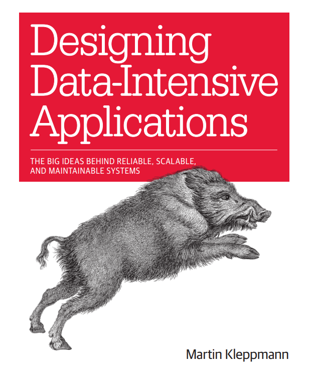

# Designing Data-Intensive Applications: The Big Ideas Behind Reliable, Scalable, and Maintainable Systems

Authors: Martin Kleppmann

<!-- TOC -->
* [Designing Data-Intensive Applications: The Big Ideas Behind Reliable, Scalable, and Maintainable Systems](#designing-data-intensive-applications-the-big-ideas-behind-reliable-scalable-and-maintainable-systems)
  * [Introduction](#introduction)
  * [PART I: Foundations of Data Systems](#part-i-foundations-of-data-systems)
    * [CHAPTER 1: Reliable, Scalable, and Maintainable Applications](#chapter-1-reliable-scalable-and-maintainable-applications)
      * [Reliability](#reliability)
      * [Scalability](#scalability)
      * [Maintainability](#maintainability)
      * [Summary](#summary)
    * [CHAPTER 2: Data Models and Query Languages](#chapter-2-data-models-and-query-languages)
      * [Relational Model Versus Document Model](#relational-model-versus-document-model)
        * [The Object-Relational Mismatch](#the-object-relational-mismatch)
        * [Many-to-One and Many-to-Many Relationships](#many-to-one-and-many-to-many-relationships)
        * [Are Document Databases Repeating History?](#are-document-databases-repeating-history)
        * [Relational Versus Document Databases Today](#relational-versus-document-databases-today)
      * [Query Languages for Data](#query-languages-for-data)
      * [Graph-Like Data Models](#graph-like-data-models)
      * [Summary](#summary-1)
    * [CHAPTER 3](#chapter-3)
    * [CHAPTER 4](#chapter-4)
  * [PART II: Distributed Data](#part-ii-distributed-data)
  * [PART III: Derived Data](#part-iii-derived-data)
<!-- TOC -->

## Introduction

The goal of this book is to help you navigate the diverse and fast-changing landscape of technologies for processing and storing data. This book is not a tutorial for one particular tool, nor is it a textbook full of dry theory. Instead, we will look at examples of successful data systems: technologies that form the foundation of many popular applications and that have to meet scalability, performance, and reliability requirements in production every day.

## PART I: Foundations of Data Systems

### CHAPTER 1: Reliable, Scalable, and Maintainable Applications
In this chapter, we will start by exploring the fundamentals of what we are trying to achieve: reliable, scalable, and maintainable data systems. We’ll clarify what those things mean, outline some ways of thinking about them, and go over the basics that we will need for later chapters.

#### Reliability
Reliability means that the system should continue to work correctly, even when things go wrong.

#### Scalability
Scalability is the term we use to describe a system’s ability to cope with increased load. Load can be described with a few numbers which we call load parameters. The best choice of parameters depends on the architecture of your system: it may be requests per second to a web server, the ratio of reads to writes in a database, the number of simultaneously active users in a chat room, the hit rate on a cache, or something else.

#### Maintainability
Maintainability means designing software in such a way that it will hopefully minimize pain during maintenance, and thus avoid creating legacy software. To this end, we will pay particular attention to three design principles for software systems:

**1- Operability:** Make it easy for operations teams to keep the system running smoothly.

**2- Simplicity:** Make it easy for new engineers to understand the system.

**3- Evolvability:** Make it easy for engineers to make changes to the system in the future.

#### Summary
In this chapter, we have explored some fundamental ways of thinking about data intensive applications. These principles will guide us through the rest of the book, where we dive into deep technical detail.

### CHAPTER 2: Data Models and Query Languages
Data models are perhaps the most important part of developing software, because they have such a profound effect: not only on how the software is written, but also on how we think about the problem that we are solving. In this chapter we will look at a range of general-purpose data models for data storage and querying. In particular, we will compare the relational model, the document model, and a few graph-based data models. We will also look at various query languages and compare their use cases.

#### Relational Model Versus Document Model

##### The Object-Relational Mismatch
The document model (e.g., JSON) often maps better to application code, especially for data with a tree-like structure. For example, an entire user profile with nested positions and education can be stored in a single document. This is simpler to retrieve than a relational model, which would require joining multiple tables (users, positions, education) to reconstruct the same profile.

##### Many-to-One and Many-to-Many Relationships
In relational databases, it’s normal to refer to rows in other tables by ID, because joins are easy. In document databases, joins are not needed for one-to-many tree structures, and support for joins is often weak.

##### Are Document Databases Repeating History?
When it comes to representing many-to-one and many-to-many relationships, relational and document databases are not fundamentally different: in both cases, the related item is referenced by a unique identifier, which is called a foreign key in the relational model and a document reference in the document model. That identifier is resolved at read time by using a join or follow-up queries.

##### Relational Versus Document Databases Today
The main arguments in favor of the document data model are schema flexibility, better performance due to data locality, and that for some applications it is closer to the data structures used by the application. The relational model counters by providing better support for joins, and many-to-one and many-to-many relationships.

It’s not possible to say in general which data model leads to simpler application code; it depends on the kinds of relationships that exist between data items. For highly interconnected data, the document model is awkward, the relational model is acceptable, and graph models are the most natural.

It seems that relational and document databases are becoming more similar over time, and that is a good thing: the data models complement each other. If a database is able to handle document-like data and also perform relational queries on it, applications can use the combination of features that best fits their needs.

#### Query Languages for Data
This section explores the fundamental difference between two types of query languages: **imperative and declarative**.

In **declarative** query languages (like SQL), you specify *what* data you want, but not *how* to retrieve it. The database's query optimizer decides the most efficient way to execute the query, which often leads to simpler code and better performance.

In contrast, **imperative** languages (like MapReduce) require you to provide step-by-step instructions on how to process the data. This gives more control but can be more complex and prevents the database from optimizing the execution plan.

This section highlights that this declarative approach is so powerful that it has been adopted for other data models, such as graph databases.

#### Graph-Like Data Models
While relational and document models work well for many data structures, they become cumbersome and inefficient when dealing with highly interconnected data, especially complex many-to-many relationships.

Graph data models are designed to address this by treating relationships as first-class citizens. A graph consists of two key components:
*   **Nodes** (or vertices): Represent entities (e.g., people, products).
*   **Edges** (or relationships): Represent the connections between nodes.

Crucially, both nodes and edges can have properties, allowing you to store rich information not just about the entities but also about the relationships themselves (e.g., the timestamp of a 'LIKES' relationship). This model makes traversing complex networks (like finding "friends of friends") intuitive and efficient.

The chapter introduces two main graph models: the **property graph model** (queried with languages like **Cypher**) and the **triple-store model** (queried with **SPARQL**). Both use a declarative approach, where you describe the pattern of nodes and relationships you want to find. The chapter also mentions **Datalog** as a more powerful, foundational data model that has influenced these modern query languages.

Graph models are the natural choice for use cases where relationships are central, such as social networks, recommendation engines, fraud detection, and knowledge graphs.

#### Summary
Data models are a powerful tool for dealing with the complexity of software, and different models are suited to different applications. The relational model has been dominant for a long time, but document and graph databases are now gaining popularity for their ability to handle specific use cases more naturally. The choice of a data model depends heavily on the structure of the data and the relationships within it. Furthermore, the move toward declarative query languages like SQL, Cypher, and SPARQL has made it easier to work with these models by allowing developers to focus on *what* they want, not *how* to get it.

### CHAPTER 3: Storage and Retrieval
Now that we've explored the logical structure of data in Chapter 2, Chapter 3 dives into the physical layer: how databases actually store and retrieve data on hardware. The way a database organizes data on disk has a profound impact on its performance for different types of tasks.
The chapter introduces a fundamental distinction between two types of workloads: Online Transaction Processing (OLTP) and Online Analytical Processing (OLAP)

We will explore the internal data structures that power these engines, such as B-Trees and LSM-Trees for transactional systems, and discover why column-oriented storage is the key to high-performance analytics. Ultimately, this chapter reveals the engineering trade-offs that determine why some databases are fast for writes, others for reads, and why different tools are needed for different jobs.

#### Data Structures That Power Your Database

##### Hash Indexes
Hash indexes are one of the simplest indexing structures, designed for fast key-value lookups.

They work by using a hash function to map a key to a specific position (or slot) in an in-memory array. This slot contains a pointer to the actual location of the data on disk.

The primary advantage is speed: to find a value, you compute the hash, go directly to the slot, and jump to the data on disk, avoiding a full file scan.

However, hash indexes have a major limitation: they are not suitable for range queries. Since the hash function scatters keys randomly, you cannot efficiently retrieve all keys within a specific range (e.g., all users with IDs between 100 and 200).

This issue motivates the need for more sophisticated structures like Log-Structured Merge-Trees (LSM-Trees), which are discussed next.

##### SSTables and LSM-Trees
This section introduces a more advanced storage structure designed to overcome the limitations of simple log files, such as file fragmentation and the inability to perform range queries.

**SSTable (Sorted String Table)**

An SSTable is a disk file where key-value pairs are sorted by key. Crucially, once an SSTable is written to disk, it is immutable (it never changes).

- **Advantage:** Because the data is sorted, it enables efficient range queries (e.g., finding all keys between 'a' and 'c').

**LSM-Tree (Log-Structured Merge-Tree)**

The LSM-Tree is the architecture that manages a collection of SSTables. It optimizes for write-heavy workloads.

**Write Path:**
When a write comes in, it is first added to an in-memory, sorted table called a MemTable. This is a very fast operation.
When the MemTable gets full, it is written to disk as a new, immutable SSTable.

**Read Path:**
To read a key, the system first checks the MemTable.
If the key isn't there, it searches the SSTables on disk, starting with the newest one.

**Compaction:**
A background process periodically merges and compacts SSTables. This process discards outdated or deleted keys, consolidates files, and keeps read performance from degrading over time.
The LSM-Tree structure makes writes extremely fast by batching them in memory before writing to disk, making it a popular choice for high-throughput systems like Cassandra and RocksDB.

##### B-Trees
In contrast to the LSM-Tree approach, B-Trees are a storage structure that keeps data sorted on disk at all times.

A B-Tree is essentially a self-balancing tree structure where each node (called a page) contains multiple keys and pointers to child nodes. These pages are designed to be the size of a disk block, making disk I/O very efficient. The tree is kept wide and shallow, meaning that finding any key requires only a few disk reads.

**Operations:**

- **Read:** To find a key, the system traverses from the root to a leaf, which is very fast and predictable.
- **Write:** When a key is updated or inserted, the system finds the appropriate page and modifies it. If a page becomes full, it splits into two, and the tree re-balances itself.

**Comparison to LSM-Trees:**

The key trade-off between B-Trees and LSM-Trees is in read vs. write 

**performance:**
B-Trees offer faster, more predictable reads because each key has a single location. However, writes can be slower due to the overhead of finding the right page and potential page splits.
LSM-Trees offer faster writes (by appending to a log in memory) but reads can be slower, as the system may need to check multiple locations (MemTable and several SSTables).
Because of their balanced performance for both reads and writes, B-Trees are the most common indexing structure in traditional relational databases like PostgreSQL, MySQL, and Oracle.

##### Comparing B-Trees and LSM-Trees

The choice between B-Trees and LSM-Trees involves a fundamental trade-off between read and write performance.

| Feature | B-Tree | LSM-Tree |
| :--- | :--- | :--- |
| **Write Speed** | Slower. Requires finding the correct page and potential page splits. | **Very Fast.** Simply appends to an in-memory log (MemTable). |
| **Read Speed** | **Faster & Predictable.** Each key has a single, known location. | Slower. Must check the MemTable and potentially multiple SSTables. |
| **Disk Overhead** | Lower. Only the modified page is rewritten. | Higher. Background compaction causes **write amplification** (rewriting data multiple times). |

**When to Use Which:**

- Use B-Trees for read-heavy workloads or when you need predictable performance for both reads and writes. This makes them the standard for most relational databases (e.g., PostgreSQL, MySQL).
- Use LSM-Trees for write-heavy workloads with very high write throughput, such as logging, time-series data, or IoT data ingestion. This is why they are the foundation of many NoSQL databases (e.g., Cassandra, RocksDB).

##### Other Indexing Structures

Beyond B-Trees and LSM-Trees, many specialized indexing structures exist to optimize for specific types of queries. The key takeaway is that no single index is best for all jobs.

**1. Clustered vs. Non-Clustered Indexes**
This distinction is about where the actual data rows are stored.

**2. Multi-dimensional Indexes (e.g., R-Tree)**
Standard indexes are ineffective for queries like "find all cafes within 500 meters." R-Trees solve this.
*   **How it works:** It groups nearby points on a map into rectangles, then groups those rectangles into larger rectangles, forming a tree structure.
*   **Use Case:** Geospatial data, allowing for efficient queries about location and proximity.

**3. Full-Text Search Indexes (e.g., Inverted Index)**
Finding a word inside a large block of text is a common challenge.
*   **How it works:** An inverted index is a map that takes a word and returns a list of all documents (or document IDs) containing that word. It works like the index at the back of a book.
*   **Use Case:** The foundation of search engines like Elasticsearch and Lucene, enabling fast keyword searches.

In summary, choosing the right tool for the job—like a B-Tree for values, an R-Tree for location, or an inverted index for text—is crucial for building high-performance applications.

#### Transaction Processing or Analytics?

This section introduces a fundamental distinction in how we use data: for operational transactions or for historical analysis. These two patterns, called OLTP (Online Transaction Processing) and OLAP (Online Analytical Processing), have very different requirements.
These workloads are so different that a single database cannot be optimal for both. A database fast for small transactions (OLTP) is too slow for big analytical scans (OLAP). This is why companies often use two separate systems: an operational database for running the business and a data warehouse for analyzing it.

##### Data Warehousing

To solve the problem of poor analytical performance on OLTP systems, companies use a separate system called a **Data Warehouse**. A data warehouse is a central repository of integrated data from one or more different sources, designed specifically for query and analysis (OLAP).

**Key Concepts:**

*   **ETL Process:** Data is moved into the warehouse via an **ETL** (Extract, Transform, Load) process:
    *   **Extract:** Pull data from operational databases (OLTP).
    *   **Transform:** Clean, normalize, and restructure the data to make it suitable for analysis.
    *   **Load:** Write the transformed data into the warehouse tables.

*   **Key Characteristics:**
    *   **Read-Only for Analysis:** Analysts query it; it's not for running the business.
    *   **Optimized for Scans:** Designed for large, complex analytical queries, not small, fast lookups.
    *   **Historical Data:** Maintains a history of changes over time, unlike OLTP systems which often just store the current state.

By separating the transactional (OLTP) and analytical (OLAP) workloads, a data warehouse allows for deep, complex analysis without impacting the performance of the day-to-day business operations.

##### Stars and Snowflakes: Schemas for Analytics

This section introduces two common design patterns for structuring data in a data warehouse: **Star Schema** and **Snowflake Schema**. The goal is to organize data in a way that makes analytical queries simple and fast.

**1. Star Schema**
This is the simplest and most common pattern. Its diagram resembles a star.
*   **Fact Table (Center):** Contains the numerical data of a business event (e.g., `sales_amount`, `quantity`). It also holds foreign keys to the dimension tables.
*   **Dimension Tables (Points):** Contain the descriptive context for the facts (e.g., `products`, `customers`, `dates`). They describe the "who, what, where, when" of an event.

**Key Characteristic:** It is **denormalized**, meaning dimension tables contain all necessary information. This minimizes the number of JOINs needed for a query, making it very fast.

**2. Snowflake Schema**
This is a more complex version of the star schema where dimension tables are **normalized**. For example, a `product` dimension might be split into a `product` table and a separate `category` table.

**Trade-off:** It reduces data redundancy and saves storage space, but it requires more JOINs, which makes queries slower and more complex.

The main difference is a trade-off between **query performance and storage size**. **Star Schema is generally preferred** in data warehousing. The small amount of space saved by a snowflake schema is not worth the cost of slower, more complex queries, as query performance and analyst simplicity are top priorities.

#### Column-Oriented Storage

#### Summary

### CHAPTER 4

## PART II: Distributed Data

## PART III: Derived Data