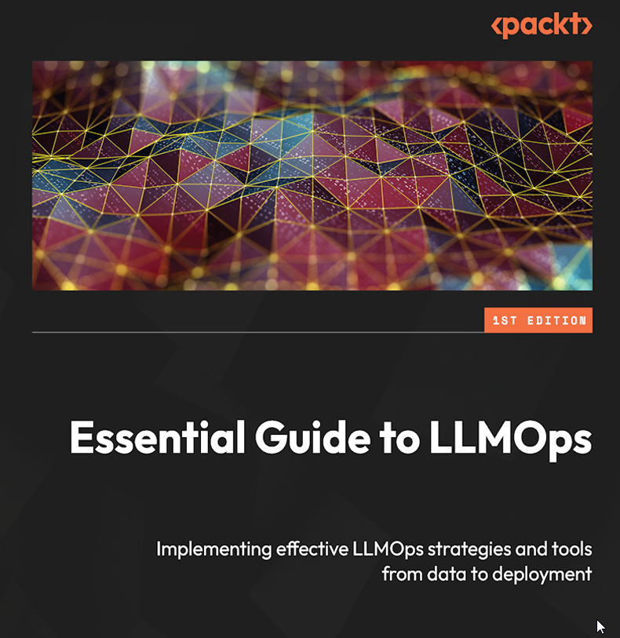
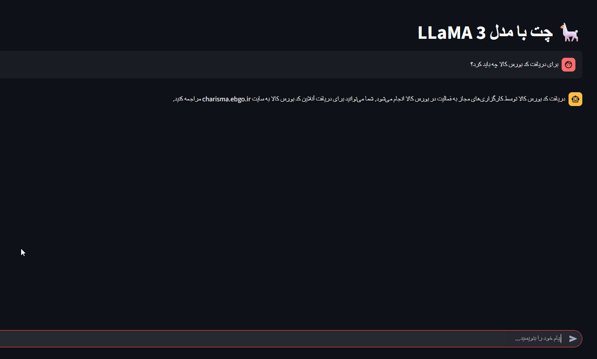

# 📘 **Essential Guide to LLMOps – Simplified Booklet**




<!-- TOC -->
* [📘 **Essential Guide to LLMOps – Simplified Booklet**](#-essential-guide-to-llmops--simplified-booklet)
  * [🔹 **Chapter 1: Data Collection and Preparation**](#-chapter-1-data-collection-and-preparation)
    * [📥 1.1 Collecting Data](#-11-collecting-data)
    * [🗃️ 1.2 Transferring Data into a Centralized Repository Schema](#-12-transferring-data-into-a-centralized-repository-schema)
    * [🔧 1.3 Preparing Data Using Apache Spark](#-13-preparing-data-using-apache-spark)
    * [⏱️ 1.4 Automating the Process Using Cron Jobs](#-14-automating-the-process-using-cron-jobs)
  * [🔹 **Chapter 2: Model Pre-training and Fine-tuning**](#-chapter-2-model-pre-training-and-fine-tuning)
    * [🔤 2.1 Creating Features](#-21-creating-features)
    * [🗂️ 2.2 Storing Features in Feast](#-22-storing-features-in-feast)
    * [📤 2.3 Retrieving Features](#-23-retrieving-features)
    * [🧠 2.4 Selecting a Foundation Model](#-24-selecting-a-foundation-model)
    * [🎯 2.5 Fine-tuning an Open Source Model](#-25-fine-tuning-an-open-source-model)
    * [🛠️ 2.6 Hyperparameter Tuning](#-26-hyperparameter-tuning)
    * [🔄 2.7 Automating Model Development Using Airflow DAG (with LLaMA-Factory)](#-27-automating-model-development-using-airflow-dag-with-llama-factory)
  * [🔹 **Chapter 3: Governance and Review**](#-chapter-3-governance-and-review)
    * [🚫 3.1 Avoiding Training Data Leakage](#-31-avoiding-training-data-leakage)
    * [🔐 3.2 Access Control](#-32-access-control)
    * [📊 3.3 Review Performance Metrics Offline](#-33-review-performance-metrics-offline)
      * [🔍 Adding Evaluation in LLaMA-Factory](#-adding-evaluation-in-llama-factory)
      * [Available tools:](#available-tools)
    * [🛡️ 3.4 Securing LLMs Against OWASP Risks](#-34-securing-llms-against-owasp-risks)
    * [📈 3.5 Operationalizing Compliance and Performance](#-35-operationalizing-compliance-and-performance)
  * [🔹 **Chapter 4: Inference, Serving, and Scalability**](#-chapter-4-inference-serving-and-scalability)
    * [⚡ 4.1 Operationalizing Inference Models](#-41-operationalizing-inference-models)
    * [🤖 4.2 Running LLaMA-Factory Models with Streamlit](#-42-running-llama-factory-models-with-streamlit)
  * [🔹 **Chapter 5: Monitoring**](#-chapter-5-monitoring)
    * [📉 5.1 Monitoring LLM Metrics](#-51-monitoring-llm-metrics)
      * [📊 5.1.1 Enhanced: Monitoring with Langfuse + DeepEval](#-511-enhanced-monitoring-with-langfuse--deepeval)
    * [🛠️ 5.2 Tools and Technologies](#-52-tools-and-technologies)
    * [🔁 5.3 Continuous Improvement](#-53-continuous-improvement)
  * [✅ **Conclusion**](#-conclusion)
  * [🧠 LLMOPS Project: Fine-Tuning and Deploying an LLM for ChatBot](#-llmops-project-fine-tuning-and-deploying-an-llm-for-chatbot)
    * [Data Preparation](#data-preparation)
    * [Automation Pipeline](#automation-pipeline)
    * [Inference with safety control](#inference-with-safety-control)
  * [Future research](#future-research)
  * [References](#references)
<!-- TOC -->


> **Based on:** _Essential Guide to LLMOps_ by Ryan Doan  
> **Simplified for:** ML Engineers, Data Scientists, and AI Practitioners  
> **Goal:** A step-by-step guide to building, training, deploying, and monitoring LLMs using LLMOps practices.

---

## 🔹 **Chapter 1: Data Collection and Preparation**

This section explains how to gather, organize, and clean data for training large language models. It covers different data types, converting data into efficient formats, using tools like Apache Spark for cleaning, and automating the process to ensure your data is ready for machine learning tasks.

High-quality data is the foundation of any successful LLM project. Proper data collection and preparation help eliminate errors, reduce bias, and improve model performance. By automating these steps, teams can handle large volumes of data efficiently and consistently, ensuring that the models are trained on reliable and up-to-date information. This chapter guides you through best practices and practical tools to streamline your data pipeline, setting the stage for effective model development.

### 📥 1.1 Collecting Data

There are three main types of data:

- **Structured**: Organized in rows/columns (e.g., CSV, databases)
- **Semi-structured**: JSON files, XML
- **Unstructured**: HTML pages, PDFs, chat logs

**Example:**  
For a customer support bot:
- Structured: Customer orders from a database
- Semi-structured: Product reviews in JSON
- Unstructured: FAQs from website HTML


**Available tools:**  

- Apache NiFi : Automate the flow of data between systems (data ingestion).
- Logstash : Collect logs and unstructured data for preprocessing.
- Airbyte : Open-source ELT tool for syncing data from any source.


---

### 🗃️ 1.2 Transferring Data into a Centralized Repository Schema

Convert all data to **Parquet format**, which is efficient for large-scale processing.

**Why Parquet?**
- Columnar format
- Compressed
- Works well with Apache Spark

**Process:**
1. Convert all data to Parquet
2. Upload to AWS S3 or Azure Blob Storage

**Example:**
```python
import pandas as pd
df = pd.read_csv("customer_data.csv")
df.to_parquet("customer_data.parquet")
```


**Available tools:**  

- LakeFS : Git-like version control layer over object storage (e.g., S3, GCS).
- Delta Lake : Open format for transactional data lakes with ACID properties.

---

### 🔧 1.3 Preparing Data Using Apache Spark

Use **Apache Spark** to clean and prepare your data at scale.

**Common Tasks:**
- Remove special characters
- Normalize text
- Handle missing or duplicate entries

**Example with PySpark:**
```python
from pyspark.sql import SparkSession
from pyspark.sql.functions import lower, regexp_replace

spark = SparkSession.builder.appName("CleanData").getOrCreate()
df = spark.read.parquet("collected_data")

cleaned_df = df.withColumn(
    "cleaned_text",
    regexp_replace(lower(col("raw_text")), "[^a-zA-Z0-9\\s]", "")
)
```

This code reads data from a Parquet file, processes the "raw_text" column by converting it to lowercase and removing special characters, and stores the cleaned text in a new column called "cleaned_text".


**Available tools:**  

- Apache Spark : Distributed processing engine for large-scale data cleaning and transformation.
- Dask : Parallel computing library similar to Spark but in Python ecosystem.

---

### ⏱️ 1.4 Automating the Process Using Cron Jobs

Automate data collection and cleaning using **cron jobs**.

**Final Output:** Annotated prompt like this:
```
[
  {
    "instruction": "بورس کالای ایران چیست؟",
    "input": "",
    "output": "بورس کالای ایران بازاری سازمان‌یافته و رسمی است که در آن کالاهای مختلف از جمله محصولات کشاورزی، صنعتی، معدنی و پتروشیمی (همچون زعفران، زیره، فلزات، فرآورده‌های نفتی و غیره) تحت نظارت و قوانین مشخص معامله می‌شوند.."
  },
  {
    "instruction": "آیا می‌توانم به صورت آنلاین در بورس کالا معامله کنم؟",
    "input": "",
    "output": "بله، در صورتی که مشتری دسترسی به درگاه معاملات برخط داشته باشد، می‌تواند به صورت آنلاین اقدام به معامله نمایند ​."
  },
  {
    "instruction": "فهرست نام و شماره تماس کارگزاری های دارای مجوز انجام معامله در کالای مورد نظر مشتری کجا وجود دارد؟",
    "input": "",
    "output": "در سایت بورس کالای ایران به نشانی : www.ime.co.ir"
  }
]
```

This dataset is in a standard and widely accepted format (Alpaca-style) and is suitable for:

Fine-tuning LLaMA-based models (e.g., LLaMA, Vicuna, Mistral, Zephyr, etc.)

**Example cron job:**
```bash
0 0 * * * /usr/bin/python3 /path/to/data_pipeline.py
```

**Available tools:**  

- Apache Airflow : Orchestrate workflows using DAGs (Directed Acyclic Graphs).
- Argo Workflows : Kubernetes-native workflow engine for automating pipelines.

---

## 🔹 **Chapter 2: Model Pre-training and Fine-tuning**

This chapter covers the essential steps to transform raw data into features, select and fine-tune foundation models, and automate the model development process. You'll learn how to tokenize data, store and retrieve features, choose the right pre-trained model, perform fine-tuning, tune hyperparameters, and use workflow automation tools like Airflow to streamline and scale your LLM development pipeline.

### 🔤 2.1 Creating Features

Convert text into numbers (tokens) that the model understands.

**Steps:**
- Tokenization
- Attention Masking

**Example using Hugging Face Tokenizer:**
```python
from transformers import AutoTokenizer

tokenizer = AutoTokenizer.from_pretrained("bert-base-uncased")
text = "How can I reset my password?"
tokens = tokenizer.encode_plus(text, max_length=512, padding='max_length', truncation=True)
```
Example output (values will be long lists):

```
{
  'input_ids': [101, 2129, 2064, 1045, 5865, 2026, 8816, 1029, 102, 0, 0, ..., 0],  # length 512
  'attention_mask': [1, 1, 1, 1, 1, 1, 1, 1, 1, 0, 0, ..., 0]  # length 512
}

```

**Available tools:**  

- Hugging Face Transformers : Tokenization and feature creation for LLMs.
- Sentence Transformers : Create sentence embeddings for semantic tasks.

---

### 🗂️ 2.2 Storing Features in Feast

> **Description:**  
> In modern machine learning pipelines, a feature store like Feast helps centralize, manage, and serve features consistently for both training and inference. By storing tokenized data and related metadata in Feast, teams ensure that models always use the same, up-to-date features, reducing errors and simplifying collaboration between data scientists and engineers.

Store features in **Feast**, a feature store for machine learning.

**What's stored:**
- Token IDs
- Attention masks
- Metadata

**Example:**  
Save tokenized data under a feature group called `llm_training_features`.

**Sample Python code:**
```python
from feast import FeatureStore, Entity, FeatureView, Field
from feast.types import Int64, String, Array
import pandas as pd

# Define entity
user_entity = Entity(name="input_id", join_keys=["input_id"])

# Example DataFrame with tokenized features
df = pd.DataFrame({
    "input_id": [123, 124],
    "token_ids": [[101, 2129, 2064], [101, 2023, 2003]],
    "attention_mask": [[1, 1, 1], [1, 1, 1]],
    "meta": ["example1", "example2"]
})

# Define FeatureView
llm_training_features = FeatureView(
    name="llm_training_features",
    entities=[user_entity],
    schema=[
        Field(name="token_ids", dtype=Array(Int64)),
        Field(name="attention_mask", dtype=Array(Int64)),
        Field(name="meta", dtype=String)
    ],
    ttl=None,
    online=True
)

# Register and ingest data
store = FeatureStore(repo_path=".")
store.apply([user_entity, llm_training_features])
store.ingest("llm_training_features", df)
```

**Available tools:**  

- Feast : Feature store for managing features used in ML models.
- Hopsworks Feature Store : Another enterprise-grade feature store with open-source core.
- Qdrant: Vector database often used as a feature store for storing and retrieving high-dimensional embeddings in ML and AI applications.


---

### 📤 2.3 Retrieving Features

- **Offline Retrieval**: For training models
- **Online Retrieval**: For real-time predictions

**Example:**
```python
from feast import FeatureStore

store = FeatureStore(repo_path=".")
features = store.get_online_features(feature_refs=["token_ids", "attention_mask"], entity_rows=[{"input_id": 123}])
```

**Available tools:**  

- Feast SDK : Use the Feast client to retrieve features for training or inference.

---

### 🧠 2.4 Selecting a Foundation Model

> **Description:**  
> Choosing the right foundation model is a critical step in building effective LLM solutions. This section explains how to evaluate and select from popular pre-trained models based on your project's requirements, such as performance, resource constraints, and intended use cases.

Choose a pre-trained model:

- **Phi3**: Lightweight, great for mobile
- **Llama**: Powerful open-source model
- **Mistral**: Great for code generation

**Example:**  
Use Phi3 for a lightweight customer service bot.


**Available tools:**  

- Hugging Face Hub : Access and download open-source foundation models (e.g., Llama, Phi, Mistral).

---

### 🎯 2.5 Fine-tuning an Open Source Model

> **Description:**  
> Fine-tuning adapts a pre-trained foundation model to your specific dataset and task, improving its performance for your use case. This section outlines the steps to customize open-source models using your own annotated data with the LLaMA-Factory framework — a powerful and flexible tool for training and instruction-tuning LLMs like LLaMA, Mistral, Phi, and more.

Fine-tune your model using a structured config and CLI with LLaMA-Factory.

Steps:

1- Install LLaMA-Factory

2- Prepare your dataset in JSON (instruction format)

3- Write your training configuration

4- Run training via CLI

**Example:**
```python

import json
import os
import subprocess

# Step 1: Define training arguments with detailed descriptions
args = dict(
    stage="sft",  # Stage of training: 'sft' means supervised fine-tuning (instruction tuning)
    do_train=True,  # Flag to enable training
    model_name_or_path="unsloth/llama-3-8b-Instruct-bnb-4bit",  # Path or model name from Hugging Face to use as the base model
    dataset="identity",  # Name of your dataset or path to your dataset (must be in supported format like JSON or JSONL)
    template="llama3",  # Prompt template style to format instruction/input/output (e.g., llama3, alpaca, chatml)
    finetuning_type="lora",  # Type of parameter-efficient fine-tuning method (e.g., lora, full, qlora)
    lora_target="q_proj,v_proj",  # Target layers to apply LoRA on (commonly attention projection layers)

    output_dir="llama3_lora_identity_final",  # Directory to save the trained model and checkpoints
    per_device_train_batch_size=2,  # Batch size per GPU
    gradient_accumulation_steps=2,  # Accumulate gradients over this many steps before backpropagation
    lr_scheduler_type="cosine",  # Learning rate scheduler type (e.g., linear, cosine, constant)
    warmup_ratio=0.1,  # Fraction of total steps used for learning rate warm-up

    logging_steps=1,  # Log training metrics every N steps
    save_steps=10,  # Save model checkpoint every N steps
    save_total_limit=2,  # Maximum number of saved checkpoints (older ones deleted)
    
    learning_rate=2e-5,  # Initial learning rate
    num_train_epochs=20,  # Number of full training epochs
    max_samples=50,  # Max number of samples to use from the dataset (useful for debugging or quick runs)
    max_grad_norm=1.0,  # Gradient clipping threshold to prevent exploding gradients
    
    loraplus_lr_ratio=4.0,  # Optional ratio to scale LoRA layers' learning rate compared to base learning rate
    fp16=True,  # Use 16-bit floating point precision for training (saves memory, speeds up training)
    report_to="none",  # Disable logging to external tools (like WandB or TensorBoard)
)

# Step 2: Save training config
with open("llama3_lora_identity_final.json", "w", encoding="utf-8") as f:
    json.dump(args, f, indent=2)

# Step 3: Change to LLaMA-Factory directory (update this path to match your setup)
os.chdir("/LLaMA-Factory")

# Step 4: Run training using the LLaMA-Factory CLI
subprocess.run(["llamafactory-cli", "train", "llama3_lora_identity_final.json"])


```
Fine-tuning with LLaMA-Factory offers a more streamlined and scalable way to adapt open-source LLMs like LLaMA-3 or Mistral using modern techniques like LoRA or QLoRA. It handles prompt formatting, tokenizer setup, and trainer orchestration out of the box—making it ideal for efficient, low-resource instruction tuning.


---

### 🛠️ 2.6 Hyperparameter Tuning

Tune settings like learning rate, batch size.

**Methods:**
- Grid Search
- Random Search
- HyperOpt

**Example:**  
Use HyperOpt to find the best learning rate between 1e-5 and 1e-3.


**Available tools:**  

- Optuna : Distributed hyperparameter optimization framework.
- Ray Tune : Scalable hyperparameter tuning library built on Ray.


---

### 🔄 2.7 Automating Model Development Using Airflow DAG (with LLaMA-Factory)

Use Airflow or Prefect to schedule and automate your LLM training pipeline. This updated DAG integrates LLaMA-Factory for fine-tuning large language models such as LLaMA 3 using your own dataset and training configuration.


**Example DAG:**
```python
from airflow import DAG
from airflow.operators.python_operator import PythonOperator
from datetime import datetime
import json
import subprocess
import os
import pandas as pd
from pyspark.sql import SparkSession
from pyspark.sql.functions import regexp_replace, lower, col

# Step 1: Simulate data collection and cleaning using PySpark
def collect_and_clean_data(**kwargs):
    spark = SparkSession.builder.appName("CleanData").getOrCreate()
    df = spark.read.parquet("/path/to/raw_data.parquet")

    cleaned_df = df.withColumn(
        "cleaned_text",
        regexp_replace(lower(col("raw_text")), "[^a-zA-Z0-9\u0600-\u06FF\s]", "")  # Persian-friendly regex
    )
    cleaned_df.write.mode("overwrite").parquet("/path/to/cleaned_data.parquet")
    print("✅ Data cleaned and saved.")

# Step 2: Convert cleaned data to LLaMA-Factory instruction format
def prepare_llama_dataset(**kwargs):
    df = pd.read_parquet("/path/to/cleaned_data.parquet")

    examples = []
    for row in df.itertuples():
        examples.append({
            "instruction": row.cleaned_text,  # Or use more structure if available
            "input": "",
            "output": "پاسخ به سوال ..."  # Replace with real labels/answers
        })

    with open("/LLaMA-Factory/data/identity.json", "w", encoding="utf-8") as f:
        json.dump(examples, f, ensure_ascii=False, indent=2)
    print("✅ Dataset formatted for LLaMA-Factory.")

# Step 3: Write training config JSON for LLaMA-Factory
def write_training_config(**kwargs):
    args = dict(
        stage="sft",
        do_train=True,
        model_name_or_path="unsloth/llama-3-8b-Instruct-bnb-4bit",
        dataset="identity",
        template="llama3",
        finetuning_type="lora",
        lora_target="q_proj,v_proj",
        output_dir="llama3_lora_identity_final",
        per_device_train_batch_size=2,
        gradient_accumulation_steps=2,
        lr_scheduler_type="cosine",
        warmup_ratio=0.1,
        logging_steps=1,
        save_steps=10,
        save_total_limit=2,
        learning_rate=2e-5,
        num_train_epochs=3,
        max_samples=200,  # Adjust based on dataset size
        max_grad_norm=1.0,
        loraplus_lr_ratio=4.0,
        fp16=True,
        report_to="none",
    )
    with open("/LLaMA-Factory/llama3_lora_identity_final.json", "w", encoding="utf-8") as f:
        json.dump(args, f, indent=2)
    print("✅ LLaMA-Factory config saved.")

# Step 4: Run training using LLaMA-Factory CLI
def run_llama_factory_training(**kwargs):
    os.chdir("/LLaMA-Factory")
    subprocess.run(["llamafactory-cli", "train", "llama3_lora_identity_final.json"])
    print("✅ Fine-tuning completed using LLaMA-Factory.")

# Step 5: Push fine-tuned model to Hugging Face (optional)
def push_to_huggingface(**kwargs):
    from huggingface_hub import login
    from transformers import AutoModelForCausalLM, AutoTokenizer

    login("your_hf_token")
    model = AutoModelForCausalLM.from_pretrained("/LLaMA-Factory/llama3_lora_identity_final")
    tokenizer = AutoTokenizer.from_pretrained("unsloth/llama-3-8b-Instruct-bnb-4bit")
    model.push_to_hub("my_llama3_finetuned_model")
    tokenizer.push_to_hub("my_llama3_finetuned_model")
    print("✅ Model pushed to Hugging Face Hub.")

# Define the DAG
with DAG(
    dag_id="llmops_pipeline_llamafactory",
    schedule_interval="@daily",
    start_date=datetime(2024, 1, 1),
    catchup=False
) as dag:

    collect_data = PythonOperator(
        task_id="collect_and_clean_data",
        python_callable=collect_and_clean_data
    )

    prepare_dataset = PythonOperator(
        task_id="prepare_llama_dataset",
        python_callable=prepare_llama_dataset
    )

    create_config = PythonOperator(
        task_id="write_training_config",
        python_callable=write_training_config
    )

    run_training = PythonOperator(
        task_id="run_llama_factory_training",
        python_callable=run_llama_factory_training
    )

    push_model = PythonOperator(
        task_id="push_to_huggingface",
        python_callable=push_to_huggingface
    )

    # Task dependencies
    collect_data >> prepare_dataset >> create_config >> run_training >> push_model


```

**Available tools:**  

- Apache Airflow : Schedule and automate model training and evaluation pipelines.


---

## 🔹 **Chapter 3: Governance and Review**
Chapter 3 focuses on ensuring that your large language model (LLM) is secure, compliant, and performing well . It covers best practices for managing risks and maintaining high standards throughout the model’s lifecycle.

### 🚫 3.1 Avoiding Training Data Leakage

Ensure no sensitive info is included in the training data.

**Example:**  
Scan for credit card numbers, emails before training.


**Available tools:**  

- Presidio : Detect and anonymize PII (Personally Identifiable Information).
- Dataherald : AI-powered synthetic data generation and leakage detection.

---

### 🔐 3.2 Access Control

Setting up role-based permissions (like Admin, Developer, User) to control who can build, test, or use models.

Implement **Role-Based Access Control (RBAC)**.

**Roles:**
- Admin: Can edit and deploy models
- Developer: Can test and view
- User: Can only interact with deployed models


**Available tools:**  

- Keycloak : Identity and access management system (supports RBAC).
- Open Policy Agent (OPA) : Policy-as-code engine for enforcing access policies.


---

### 📊 3.3 Review Performance Metrics Offline

Measuring how well the model works using metrics like accuracy, F1 score, BLEU/ROUGE for translation, and readability scores for conversational models is essential before deploying any LLM. This offline evaluation ensures that:

- The model generalizes well to unseen data.

- Performance meets quality thresholds.

- There is no regression from previous versions.

By evaluating models before deployment, teams can catch issues like overfitting, poor instruction-following, or degraded output quality — critical for compliance and governance.


#### 🔍 Adding Evaluation in LLaMA-Factory


LLaMA-Factory supports built-in evaluation during and after training using a held-out validation dataset. It logs key metrics such as:

- `eval_loss`: Measures prediction error on the evaluation set.
- `eval_perplexity`: Indicates how well the model predicts the next token (lower = better).
- `training_loss`: For comparison with eval loss to detect overfitting.


You can configure evaluation directly in your training script by enabling `do_eval=True` and specifying an evaluation dataset.

✅ Step-by-Step: Enable Evaluation in LLaMA-Factory

1- Prepare a separate evaluation dataset
Create a file like `identity_eval.json` in `/LLaMA-Factory/data/`:


```json
[
  {
    "instruction": "بورس کالای ایران چیست؟",
    "input": "",
    "output": "بورس کالای ایران بازاری سازمان‌یافته و رسمی است که در آن کالاهای مختلف تحت نظارت معامله می‌شوند."
  },
  {
    "instruction": "آیا می‌توانم به صورت آنلاین معامله کنم؟",
    "input": "",
    "output": "بله، در صورتی که دسترسی به درگاه معاملات برخط داشته باشید، می‌توانید آنلاین معامله کنید."
  }
]

```

2- Update your training configuration to include evaluation:

```python
args = dict(
    stage="sft",
    do_train=True,
    do_eval=True,                        # ✅ Enable evaluation
    model_name_or_path="unsloth/llama-3-8b-Instruct-bnb-4bit",
    dataset="identity",                  # Training dataset
    eval_dataset="identity_eval",        # 👈 Evaluation dataset
    template="llama3",
    finetuning_type="lora",
    output_dir="llama3_lora_identity_final",
    per_device_train_batch_size=2,
    per_device_eval_batch_size=2,        # Batch size for eval
    learning_rate=2e-5,
    num_train_epochs=3,
    eval_steps=10,                       # Run eval every 10 steps
    evaluation_strategy="steps",
    save_total_limit=2,
    load_best_model_at_end=True,         # Save best model based on metric
    metric_for_best_model="eval_loss",   # Choose best model by lowest loss
    greater_is_better=False,
    fp16=True,
    report_to="mlflow",                  # Log to MLflow (or "wandb")
)
```
3- Run training — evaluation will happen automatically:

```python
llamafactory-cli train llama3_lora_identity_final.json
```
4- View results in logs or integrated tools:

```python
[INFO] Step 10: eval_loss = 1.87, eval_perplexity = 6.48
[INFO] Step 20: eval_loss = 1.52, eval_perplexity = 4.57
```

#### Available tools:

DeepEval (Recommended for advanced metrics): Evaluate faithfulness, relevance, toxicity — ideal for governance reporting.

### 🛡️ 3.4 Securing LLMs Against OWASP Risks

Protecting models from common threats like prompt injection, insecure outputs, and poisoned training data (as outlined in OWASP guidelines).

Protect against:
- Prompt Injection
- Insecure Output Handling
- Training Data Poisoning

**Example:**  
Validate user inputs to reject malicious queries.


**Available tools:**  

- Plexiglass : Adversarial testing for LLMs against OWASP threats.
- Giskard : Detect vulnerabilities such as bias, prompt injection, and hallucinations.
- Langkit : Evaluate and monitor prompts/responses for security risks.

---

### 📈 3.5 Operationalizing Compliance and Performance

Set up pipelines to check compliance and performance daily. Using tools like Apache Airflow to automatically scan for issues and log performance metrics on a regular basis.

**Example:**  
Use Airflow to scan for OWASP vulnerabilities and log metrics.


Below is a simple Apache Airflow DAG that automates the Governance and Review processes described in Chapter 3

```python
# File: governance_review_dag.py
from airflow import DAG
from airflow.operators.python_operator import PythonOperator
from datetime import datetime

# Dummy functions simulating governance tasks

def scan_for_data_leakage(**kwargs):
    """Scan dataset for PII or sensitive info before training."""
    print("🧹 Scanning for data leakage (PII, emails, credit cards)...")
    # Simulate scanning logic
    print("✅ No sensitive data found.")

def validate_access_control(**kwargs):
    """Check if access roles are correctly enforced."""
    print("🔐 Validating Role-Based Access Control (RBAC)...")
    # Simulate checking user permissions
    print("✅ Access policies verified.")

def evaluate_model_performance(**kwargs):
    """Evaluate model using offline metrics like F1, ROUGE, BLEU."""
    print("📊 Evaluating model performance (F1, ROUGE)...")
    # Simulate metric calculation
    print("✅ Performance metrics logged.")

def check_owasp_security(**kwargs):
    """Scan model inputs/outputs for OWASP risks."""
    print("🛡️ Checking for OWASP vulnerabilities (prompt injection, output safety)...")
    # Simulate input/output validation
    print("✅ No security issues detected.")

def log_compliance_and_metrics(**kwargs):
    """Log results to monitoring system or dashboard."""
    print("📈 Logging compliance and performance to monitoring system...")
    print("✅ Compliance report generated.")

# Define DAG
with DAG(
    dag_id="llm_governance_review",
    description="Automated governance and review pipeline for LLMs",
    schedule_interval="@daily",
    start_date=datetime(2025, 1, 1),
    catchup=False
) as dag:

    task_leakage = PythonOperator(
        task_id="scan_data_leakage",
        python_callable=scan_for_data_leakage
    )

    task_access = PythonOperator(
        task_id="validate_access_control",
        python_callable=validate_access_control
    )

    task_performance = PythonOperator(
        task_id="evaluate_model_performance",
        python_callable=evaluate_model_performance
    )

    task_owasp = PythonOperator(
        task_id="check_owasp_vulnerabilities",
        python_callable=check_owasp_security
    )

    task_reporting = PythonOperator(
        task_id="log_compliance_metrics",
        python_callable=log_compliance_and_metrics
    )

    # Define task dependencies
    task_leakage >> task_access >> task_performance >> task_owasp >> task_reporting

```


**Available tools:**  

- Evidently AI : Monitor data drift, model decay, and performance degradation.
- WhyLogs : Real-time observability and monitoring of data quality and drift.


---

## 🔹 **Chapter 4: Inference, Serving, and Scalability**

This chapter guides you through deploying and running fine-tuned large language models (LLMs) in real-world settings using modern tools like LLaMA-Factory and Streamlit. You’ll learn how to make models interactive, fast, and scalable for production use cases.

### ⚡ 4.1 Operationalizing Inference Models

Types of inference:
- **Real-time**: Immediate responses for interactive applications like chatbots.
- **Batch**: Processing large datasets periodically or on demand.
- **Interactive**: Dynamic conversations with streaming output, ideal for assistants.

**Model Optimization:**
- Pruning: Pruning is the process of removing unnecessary or less important neurons, weights, or layers from a neural network to reduce its size and computational requirements — without significantly affecting its performance.
- Quantization: Quantization reduces the precision of the model’s weights and activations — for example, converting 32-bit floating-point numbers (float32) to 16-bit floats (float16) or even 8-bit integers (int8).

**Hardware Trade-off:**
- GPU for speed
- TPU for cost-efficiency

**Example:**  
Load unsloth/llama-3-8b-Instruct-bnb-4bit using 4-bit quantization for minimal memory footprint on consumer GPUs.

### 🤖 4.2 Running LLaMA-Factory Models with Streamlit

Unlike traditional inference APIs that use Hugging Face pipelines, here we deploy a fine-tuned LLaMA-Factory model using a Streamlit interface with caching and memory optimization:

```python

import os
import streamlit as st
from llamafactory.chat import ChatModel
from llamafactory.extras.misc import torch_gc

# تغییر مسیر به دایرکتوری مدل
os.chdir("/LLaMA-Factory")

# بارگذاری مدل با کش
@st.cache_resource
def load_model():
    args = dict(
        model_name_or_path="unsloth/llama-3-8b-Instruct-bnb-4bit",
        # adapter_name_or_path="llama3_lora",
        adapter_name_or_path="llama3_lora_identity_overfit",
        # adapter_name_or_path="llama3_lora_identity_final",
        template="llama3",
        finetuning_type="lora",
    )
    return ChatModel(args)

chat_model = load_model()

# Persian RTL interface with chat streaming
user_input = st.chat_input("پیام خود را بنویسید...")

if user_input:
    st.session_state.messages.append({"role": "user", "content": user_input})

    with st.chat_message("assistant"):
        response = ""
        for chunk in chat_model.stream_chat(st.session_state.messages):
            response += chunk
            st.write(response + "▌")


```

here is the sample generated UI:




## 🔹 **Chapter 5: Monitoring**

Once a large language model (LLM) is deployed into production, it’s critical to continuously monitor its performance, behavior, and reliability to ensure it continues to deliver accurate, safe, and efficient results over time. This chapter introduces the key aspects of LLM monitoring , including what metrics to track, which tools to use, and how to implement a cycle of continuous improvement.

### 📉 5.1 Monitoring LLM Metrics

| Category | Metric |
|---------|--------|
| Performance | Accuracy, F1, Perplexity |: Measure how well the model performs on its intended task
| Operational | Latency, Throughput |: Track system health and responsiveness
| Compliance | Data drift, Model decay |: Ensure ethical and regulatory compliance


**Example:**  
Track response time and alert if it goes above 1 second.


**Available tools:**  

- Prometheus + Grafana : Monitor real-time metrics like latency, throughput, and error rates.
- ELK Stack (Elasticsearch, Logstash, Kibana) : Logs and metric visualization.


#### 📊 5.1.1 Enhanced: Monitoring with Langfuse + DeepEval

**🔍 Why Use Langfuse + DeepEval?**
While tools like Prometheus + Grafana and the ELK Stack are great for system-level metrics (e.g., latency, throughput), they don’t directly measure the quality of LLM outputs , such as:

- Accuracy
- Relevance
- Toxicity
- Hallucinations
- Bias

This is where Langfuse and DeepEval come in — they provide LLM-specific observability and evaluation capabilities , allowing you to monitor and improve model performance continuously.

**🧠 What Is Langfuse?**
Langfuse is an open-source observability platform for LLM applications that helps you:

- Trace prompts and responses
- Monitor usage and cost
- Debug chains and agents
- Visualize traces and logs
- Evaluate response quality using custom or built-in scorers

It works well with frameworks like LangChain , LlamaIndex , and FastAPI-based services.

**🔍 What Is DeepEval?**

DeepEval is an open-source framework for evaluating LLM outputs based on multiple dimensions such as:

- Answer Relevance
- Contextual Precision & Recall
- Faithfulness (Hallucination Detection)
- Toxicity
- Bias
- Summarization Quality (ROUGE, BLEU)

It integrates with Langfuse to log evaluations automatically and can be used in testing pipelines or real-time inference monitoring.

By integrating Langfuse and DeepEval , you gain full-stack visibility into both:

- Operational metrics (latency, error rate, tokens/sec)
- Quality metrics (relevance, hallucination, toxicity)

This makes your LLM deployment more transparent, reliable, and enterprise-ready , which is essential for real-world LLMOps implementations.-


---

### 🛠️ 5.2 Tools and Technologies

**Cloud-based tools:**
- Google Vertex AI
- Azure ML
- Amazon SageMaker

**Custom tools:**
- ELK Stack (Elasticsearch + Logstash + Kibana)

**Example:**  
Use ELK stack to visualize trends in response times.


**Available tools:**  

- Arize-Phoenix : Observability platform for LLMs (open-core).
- Traceloop OpenLLMetry : OpenTelemetry-based observability for LLM apps.
- Helicone : Open-source observability for LLM APIs.

---

### 🔁 5.3 Continuous Improvement

Repeat the cycle:
- Train → Evaluate → Learn → Update → Deploy → Repeat

**Tools:**
- **QLoRA**: Efficient fine-tuning
- **LangChain**: Chain prompts and responses

**Example Pipeline:**
1. Every week, collect new user interactions
2. Retrain using QLoRA
3. Test performance
4. Deploy if better than current version


By integrating robust monitoring practices into your LLMOps pipeline, you ensure that your LLMs remain accurate, reliable, and aligned with business goals and ethical standards throughout their lifecycle.


**Available tools:**  

- Langfuse : Open-source tracing, prompt management, and evaluation platform.
- Promptfoo : Test and evaluate prompts across multiple LLM providers.
- Guardrails.io : Validate and guardrail LLM outputs for correctness and safety.

---

## ✅ **Conclusion**

This booklet walks you through the full lifecycle of building and managing large language models using **LLMOps**. From collecting and preparing data to deploying and monitoring models, you now have a practical roadmap to build scalable, secure, and high-performing AI systems.

## 🧠 LLMOPS Project: Fine-Tuning and Deploying an LLM for ChatBot

This project demonstrates a simple LLMOps pipeline for training, automating, and deploying a Large Language Model (LLM) tailored to answer Python-related questions from Stack Overflow.


This project is divided into three main sections:


### Data Preparation
Extract relevant question-answer pairs from the Stack Overflow Public Dataset on BigQuery, prepare them for training, and split into train and evaluation sets.

### Automation Pipeline
Create a Pipelines workflow to automate the fine-tuning of an open-source LLM using the prepared dataset and pushing the trained model to Huggingface.

### Inference with safety control

Deploy the fine-tuned model via a REST API using FastAPI.

## Future research

- Using Hyper-parameter tuning tools to get better results like HyperOpt
- Using the pre-trained Llama model in a RAG system instead of fine-tuning the Llama model and comparing the results with the results of the present study

## References

- [Essential Guide to LLMOps](https://www.oreilly.com/library/view/essential-guide-to/9781835887509/)
- [Building LLM Powered Applications](https://www.packtpub.com/en-si/product/building-llm-powered-applications-9781835462317)

- [Awesome LLMOps Github Repository](https://github.com/tensorchord/Awesome-LLMOps)

- [LLMOPs course in DeepLearning.ai website](https://learn.deeplearning.ai/courses/llmops/lesson/jupuw/introduction)

- [Sample fine-tuned LLM model](https://huggingface.co/hamedasgari20/stackoverflow-flan-t5-small)

